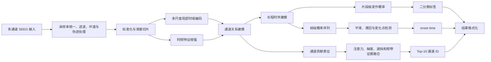

# 基于 SEEG 的癫痫发作状态智能检测算法方案

## 文档说明

本方案面向“基于 SEEG 的癫痫发作状态智能检测”竞赛任务，围绕多通道 SEEG 时间序列，建立覆盖信号预处理、发作状态识别、发作起始点定位、关键通道解释和轻量化部署的完整算法体系。方案同时考虑分类性能、跨受试者泛化、定位精度、解释稳定性、推理时延和算力占用。

由于比赛数据格式、采样率、通道配置、片段长度及 onset 标注粒度尚未完全公开，文中首先给出合理工程假设。实际数据到位后，应通过数据审计和患者级交叉验证校准采样率、滤波带宽、窗口长度、模型容量、判定阈值及后处理参数，不将初始参数直接视为最终配置。

## 目录

1. [总体技术路线](#一总体技术路线)
2. [任务难点与设计原则](#二任务难点与设计原则)
3. [数据预处理与样本构建](#三数据预处理与样本构建)
4. [发作状态识别模型设计](#四发作状态识别模型设计)
5. [发作起始点定位方法](#五发作起始点定位方法)
6. [关键通道识别策略](#六关键通道识别策略)
7. [推理与部署方案](#七推理与部署方案)
8. [模型轻量化与算力优化](#八模型轻量化与算力优化)
9. [训练验证与消融实验设计](#九训练验证与消融实验设计)
10. [预期优势与风险控制](#十预期优势与风险控制)
11. [最终技术方案摘要](#十一最终技术方案摘要)

---

## 一、总体技术路线

本方案构建“统一信号预处理—多尺度表征学习—发作状态识别—起始点定位—关键通道归因—轻量化部署”的端到端检测体系。模型以原始或近原始 SEEG 波形为主要输入，在共享通道编码器中提取局部波形、节律变化和瞬态放电特征；通过时频增强分支保留发作相关的频带能量演化；利用稀疏通道关系网络刻画电极间同步、传播和去同步模式；再以轻量级时序模块整合长程演化信息，同时输出片段级发作概率、帧级发作概率及通道贡献表征。

整体技术路线如下：



状态识别、起始点定位和通道解释不采用彼此独立的模型，而是在统一特征空间中联合学习。片段级分类头负责总体状态判断，帧级定位头保留时间分辨率，通道归因模块利用共享中间特征计算通道贡献。该设计可减少多个独立模型之间的输出冲突，并使最终结论能够追溯至同一段信号证据。

### 1.1 数据条件的合理假设

| 项目 | 初始假设 | 数据到位后的校准方式 |
|---|---|---|
| 数据组织 | 每个样本包含通道 ID、采样率及形状为 `C × T` 的波形 | 编写数据审计程序核验张量方向、单位、缺失值和通道命名规则 |
| 采样率 | 原始采样率不低于 256 Hz，可能存在多种采样率 | 统计全量采样率分布，选择 256 Hz 或 512 Hz 统一建模 |
| 信号单位 | 以 μV 或可换算为 μV 的物理量存储 | 结合元数据与幅值分位数核验，不根据文件类型直接推断 |
| 工频 | 数据以 50 Hz 工频为主 | 根据功率谱峰值自动识别 50/60 Hz，并与采集元数据核对 |
| 通道数 | 不同患者或样本的通道数可能不同 | 使用通道掩码、共享通道编码器和可变长通道聚合 |
| 片段长度 | 样本长度可能固定，也可能变化 | 统一采用滑窗推理，末端补齐并记录有效长度掩码 |
| 标签粒度 | 至少包含片段级标签，部分或全部发作样本具有 onset 标注 | 按标注粒度选择强监督、弱监督或伪标签定位策略 |
| 数据划分 | 同一患者可能包含多个样本或多次发作 | 训练、验证和测试均以患者为最小隔离单元 |
| 空间信息 | 通道 ID 必有，三维电极坐标可能缺失 | 有坐标时加入空间邻接；无坐标时使用信号相关动态图 |
| 输出格式 | 每个样本输出标签、概率和 Top-10；阳性样本输出 onset | 以官方提交模板和评测脚本为最终格式依据 |

数据到位后，首先统计采样率、片段时长、通道数、幅值单位、缺失比例、工频峰值、类别比例、患者样本量、发作持续时间和 onset 标注精度。预处理带宽、窗口长度、输出帧率及模型容量均依据审计结果重新确定。

---

## 二、任务难点与设计原则

SEEG 具有通道数量多、采样频率高、空间分布不规则和患者间植入方案不一致等特征。同一发作在不同脑区、不同患者和不同发作阶段可能呈现不同形态；局部低幅快活动、节律性尖波、高频能量上升、谱结构变化和跨通道同步增强均可能构成有效证据，但不存在适用于全部患者的单一波形模板。

跨受试者泛化是首要约束。患者身份、植入位置、参考方式及记录设备可能形成强于疾病状态的统计特征。若模型依赖固定通道序号或患者特有幅值分布，随机样本划分会产生虚高结果。方案因此采用患者级划分、通道共享编码、稳健标准化、通道缺失增强和患者均衡采样，限制模型对固定植入布局和绝对幅值的依赖。

类别不平衡同时存在于患者级、样本级和帧级。发作期样本通常少于发作间期样本；一个阳性片段内，真正发作区间也可能短于背景区间。本方案采用患者—类别双重均衡采样、类别加权损失、困难负样本挖掘和边界加权监督，不使用简单复制少数类样本作为主要平衡手段。

onset 定位要求模型保留足够的时间分辨率。仅对完整片段执行全局池化，即使分类准确，也难以恢复发作起点。方案在网络中保留 8～16 Hz 的帧级输出，通过概率平滑、连续阳性、滞回阈值和变化点检测抑制孤立误报，并显式校正滤波群延迟、滑窗中心位置和补齐区间。

通道注意力不能直接等同于临床致痫区证据。注意力反映模型的信息分配，梯度反映局部敏感性，遮挡实验反映通道对最终预测的反事实贡献，频带变化提供可复核的信号学依据。方案融合四类证据，并将结果限定为“本片段判定的重要通道”，不将其未经临床验证地解释为发作起始区或手术靶点。

低时延推理从网络结构、数据流水线和解释计算三方面共同控制。除蒸馏、剪枝和量化外，还通过滤波缓存、STFT 缓存、重叠窗口特征复用、批量推理及候选通道批量遮挡减少重复计算。最终以目标硬件上的端到端时延为评价依据，不以单次神经网络前向耗时替代系统耗时。

---

## 三、数据预处理与样本构建

### 3.1 重采样与滤波

当原始采样率不低于 512 Hz，且数据中存在稳定的 100 Hz 以上判别信息时，统一重采样至 512 Hz，以保留较高频活动；若原始数据主要为 256 Hz，或比赛算力约束较强，则统一至 256 Hz，并将有效带宽限制在奈奎斯特频率以下。重采样采用带抗混叠滤波的多相 FIR 方法，避免直接抽取造成频谱混叠。

默认带通范围设为 0.5～180 Hz（512 Hz 模式）或 0.5～100 Hz（256 Hz 模式）。高通部分抑制基线漂移，低通部分抑制无效高频噪声。工频处理采用窄带 IIR 陷波或频域自适应抑制，在 50 Hz 及落入有效带宽的谐波处设置陷波；若数据来自 60 Hz 工频环境，则按功率谱峰值自动切换。

分类任务可以比较离线零相位滤波与因果滤波，但 onset 定位必须单独核验边界泄漏。正式方案优先采用线性相位 FIR 并补偿群延迟，或使用因果 IIR 并标定系统延迟，防止滤波器将发作后信息扩散至 onset 之前。片段边缘采用反射补齐，补齐区域不参与帧级损失和 onset 搜索。

### 3.2 坏道检测与伪迹处理

对每个通道计算缺失值比例、恒定值比例、幅值中位绝对偏差、峰峰值、饱和比例、线噪声比、谱熵以及与其他通道的相关性。出现长时间恒定、严重缺失、幅值显著偏离患者内分布、工频能量异常集中或持续削顶的通道标记为疑似坏道。

坏道不直接从张量中删除，而是生成通道有效掩码。短时缺失可采用线性或样条插值；整段失效通道置零并由掩码阻断其图连接、注意力和池化贡献。训练阶段随机执行通道丢弃，以提高模型对测试时通道缺失的适应能力。

肌电、运动、电极爆裂等伪迹通过幅值突变、宽带同步增能、高频谱斜率和通道一致性联合识别。疑似伪迹帧保留质量评分，而不直接删除全部高频活动，因为发作起始本身可能表现为低幅快活动。质量评分作为模型附加输入，并用于调整 onset 触发阈值。

### 3.3 参考重构

若原始数据已使用统一参考，首先保留该版本作为基线。随后比较共同平均参考、稳健共同平均参考和双极参考。稳健共同平均参考仅使用质量合格通道，并采用截尾均值降低异常通道影响。若通道命名能够恢复同一电极杆上的接点顺序，则构建相邻接点双极导联。

双极参考有助于抑制远场共同成分，但会改变通道 ID 语义。因此，双极导联的归因结果必须映射回构成该导联的原始接点，并在提交格式中保持原始通道 ID。

### 3.4 幅值标准化

采用患者内或片段内的稳健标准化：

$$
\tilde{x}_{c,t}=
\operatorname{clip}\left(
\frac{x_{c,t}-\operatorname{median}(x_c)}
{1.4826\operatorname{MAD}(x_c)+\varepsilon},
-q,q
\right),
$$

其中，$q$ 初始取 8～12。若提供足够长的患者基线，优先使用患者发作间期统计量；若测试患者完全未知，则使用片段内稳健统计量，并将原始对数幅值尺度作为附加特征，避免标准化完全抹去具有判别力的幅值变化。

### 3.5 滑窗切片与标签对齐

主分类窗口初始设为 4 s，步长设为 0.5 s，模型内部保持约 0.125 s 的输出帧间隔。4 s 窗口通常能够覆盖节律演化，同时不会使局部发作证据被过长背景稀释。若数据审计显示典型发作演化较慢，可增加 8 s 上下文分支，但仍保留高分辨率帧级输出。

窗口标签不采用“只要包含一个发作采样点即判为阳性”的简单规则，而根据窗口内发作占比和 onset 位置设置。发作占比高于阈值 $r_+$ 的窗口作为片段级阳性；完全位于发作间期且距 onset 超过安全间隔的窗口作为阴性；跨越边界但发作占比较低的窗口保留帧级标签，同时降低片段级损失权重。发作前期是否作为阴性应严格依据比赛定义，不能与发作预测或预警任务混用。

训练、验证、交叉验证均以患者为最小划分单位。同一患者的不同发作、相邻切片和增强样本不得跨集合。超参数选择及概率校准只能使用训练折内的患者级验证集。

### 3.6 跨受试者数据增强

增强方式包括幅值缩放、低强度有色噪声、随机时间遮挡、频带遮挡、随机通道丢弃、通道顺序扰动、轻微基线漂移和局部增益变化。时间拉伸、裁剪或拼接会改变 onset，只有在同步变换帧级标签和 onset 标注时才使用。频率平移幅度应严格受限，避免破坏具有临床含义的节律位置。

Mixup 仅在相同参考方式、相近采样条件和相同标签类别内使用。具有 onset 标注的发作样本不采用会破坏边界语义的普通 Mixup。所有增强强度通过患者级验证集确定，并同时检查 Recall、Specificity 和 onset MAE。

---

## 四、发作状态识别模型设计

### 4.1 输入张量

单个模型窗口表示为：

$$
X\in\mathbb{R}^{B\times C\times T},
$$

其中，$B$ 为批量大小，$C$ 为有效通道数，$T=L\cdot f_s$。模型同时接收通道有效掩码 $M\in\{0,1\}^{B\times C}$、帧有效掩码和可选的电极空间坐标。不同样本通道数不一致时，在批次内补齐至最大通道数；补齐通道不参与归一化、图连接、池化和损失计算。

### 4.2 主模型架构：MS-STGTCN

主模型采用多尺度时域编码、时频增强、稀疏通道图和门控时序卷积结构，记为 MS-STGTCN（Multi-Scale Spatio-Temporal Graph Temporal Convolutional Network）。

#### 4.2.1 局部时域特征提取

各通道共享同一组一维卷积参数，避免模型记忆固定通道编号。时域编码器由三条深度可分离卷积分支构成，其感受野分别覆盖短时尖波、中等节律和慢速形态变化。在 512 Hz 下，可采用 7、31、127 点卷积核，后接逐点卷积、归一化、SiLU 激活和残差连接。

共享编码器将各通道投影至统一表征空间。深度可分离卷积降低参数量，多尺度卷积避免仅用固定波形宽度描述发作形态，适合 SEEG 中尖波、快速活动和缓慢节律演化并存的情况。

#### 4.2.2 时频特征增强

时频分支采用可微滤波器组或 STFT 对数功率特征。初始频带包括 δ、θ、α、β、低 γ 和高 γ，并增加工频邻域质量特征。对于 512 Hz 数据，可评估 80～180 Hz 频段，但仅在抗混叠和伪迹控制可靠时纳入主模型。

时频特征经轻量二维卷积或逐频带线性映射后，与时域特征在相同帧率下进行门控融合：

$$
H_{c,k}=
G_{c,k}\odot H^{\mathrm{time}}_{c,k}
+(1-G_{c,k})\odot H^{\mathrm{tf}}_{c,k}.
$$

该结构既保留从原始波形学习非预设形态的能力，也显式提供节律性增能和频谱迁移证据。

#### 4.2.3 通道间关系建模

通道关系采用稀疏图注意力，邻接关系由稳健相关、频带相干、可选空间距离及特征相似度共同构成：

$$
A=\lambda_1A_{\mathrm{corr}}
+\lambda_2A_{\mathrm{coh}}
+\lambda_3A_{\mathrm{space}}
+\lambda_4A_{\mathrm{learn}}.
$$

无空间坐标时令 $A_{\mathrm{space}}=0$。每个节点仅保留 Top-$k$ 邻居，避免完整 $C^2$ 图在通道数较多时造成计算膨胀。图注意力用于捕捉发作传播相关的同步变化，同时保留节点自身残差，防止强聚合抹去局灶性低幅快活动。

通道 ID 默认不作为固定嵌入直接输入模型，避免在跨患者条件下形成通道编号依赖。只有训练集和测试集共享严格一致的电极定义时，才将通道 ID 作为弱辅助信息。

#### 4.2.4 长程时序依赖建模

通道特征经掩码注意力池化形成帧序列 $Z\in\mathbb{R}^{B\times K\times D}$。长程建模采用扩张深度可分离 TCN 与轻量门控注意力组合。TCN 处理局部至中长程节律演化，线性复杂度注意力补充较远时间位置之间的依赖。

与完整 Transformer 相比，该结构对长 SEEG 序列的内存开销更低，部署算子更稳定，也更适合 ONNX、TensorRT 和 CPU 推理。网络保持固定帧率，不在中间层过早执行全局池化。

#### 4.2.5 发作概率输出头

模型设置帧级和片段级两个输出头：

$$
p_k=\sigma(W_fZ_k+b_f),
$$

其中 $p_k$ 表示第 $k$ 帧的发作概率。片段概率由质量加权的注意力池化产生：

$$
p_{\mathrm{clip}}=
\sigma\left(
W_c\sum_k\alpha_kZ_k+b_c
\right).
$$

片段概率不直接取帧概率最大值，以降低单个伪迹帧导致整段误判的风险。同时引入一致性约束，使片段概率与高置信帧聚合结果保持一致。

### 4.3 损失函数

联合损失定义为：

$$
\mathcal{L}=
\lambda_c\mathcal{L}_{\mathrm{clip}}
+\lambda_f\mathcal{L}_{\mathrm{frame}}
+\lambda_b\mathcal{L}_{\mathrm{boundary}}
+\lambda_s\mathcal{L}_{\mathrm{cons}}
+\lambda_r\mathcal{L}_{\mathrm{reg}}.
$$

其中，片段级损失采用类别加权 BCE 或非对称 Focal Loss；帧级损失采用 Focal BCE 与 Soft Dice 的组合；边界损失对 onset 邻域提高权重，或直接回归帧到 onset 的相对距离；一致性损失约束片段头和帧级聚合结果；正则项包括图稀疏约束、注意力熵约束和权重衰减。

若只有片段标签而无精确 onset，可采用多实例学习：阳性片段中至少存在连续高概率区域，阴性片段各帧均应保持低概率。随后利用高置信伪边界迭代训练定位头，但该条件下须单独报告定位不确定性。

### 4.4 训练策略

训练采用 AdamW 优化器、余弦退火和前若干 epoch 的线性预热。批次采样同时平衡患者与类别，防止样本量较大的患者主导梯度。可先训练时域和时频编码器，再加入通道图与帧级定位头联合微调；若数据规模充足，则直接端到端训练。

困难负样本挖掘重点纳入电极爆裂、运动伪迹、睡眠尖波和周期性放电等易误判片段。早停依据患者宏平均 AUC、F1 和 onset MAE 的综合指标，而非窗口级准确率。

### 4.5 概率校准

模型训练完成后，在完全独立的患者级校准集上执行温度缩放：

$$
p^{\mathrm{cal}}=\sigma(z/T).
$$

若校准样本量充足且可靠性曲线呈明显非线性，可比较向量温度缩放和保序回归。最终分类阈值 $\tau$ 依据比赛主指标、灵敏度约束和患者级验证结果确定，不预设为 0.5。输出概率使用校准后的数值并四舍五入至 6 位小数；标签由未舍入概率与阈值比较得到。

---

## 五、发作起始点定位方法

### 5.1 帧级概率重建

对长片段执行重叠窗口推理后，同一时间帧可能获得多个预测。采用窗口中心加权方式融合：

$$
\bar p_k=
\frac{\sum_w q_{w,k}p_{w,k}}
{\sum_w q_{w,k}+\varepsilon},
$$

其中 $q_{w,k}$ 为三角形或 Hann 权重，使窗口边缘的低可靠预测贡献较小。滤波群延迟、模型感受野中心偏移及重采样时间映射在此阶段统一补偿。

### 5.2 概率平滑与阈值滞回

首先对 $\bar p_k$ 进行 0.25～0.75 s 中值滤波，去除孤立尖峰；随后使用指数移动平均或一维高斯滤波。平滑尺度通过患者级验证确定，避免过强平滑造成 onset 系统性延后。

状态机采用双阈值滞回机制。高阈值 $\tau_h$ 用于触发候选发作，低阈值 $\tau_l$ 用于维持发作状态，且 $\tau_h>\tau_l$。候选 onset 需满足：概率越过高阈值；后续至少 $D_{\min}$ 秒内大部分帧高于低阈值；候选区间平均概率、最大概率和上升斜率达到最低要求；低质量伪迹帧不能独立触发发作。

连续阳性约束用于抑制短暂尖波、电极爆裂和单帧模型波动。$\tau_h$、$\tau_l$ 和 $D_{\min}$ 均由训练折内部验证确定。

### 5.3 变化点检测与起点校正

滞回机制得到的触发时间通常晚于真实 onset。为向前校正，在触发点之前的限定搜索区间内构造联合变化量：

$$
R_k=
w_p\Delta\operatorname{logit}(\bar p_k)
+w_e\Delta E_k
+w_s\Delta S_k,
$$

其中，$\Delta E_k$ 表示判别频带能量相对基线的变化，$\Delta S_k$ 表示通道同步或图结构变化。采用 CUSUM、PELT 或局部最大变化率搜索首个持续变化点，并要求变化后概率维持在较高水平。最终 onset 由滞回触发点和变化点校正结果联合确定，不采用“首次超过 0.5”作为唯一规则。

时间输出为：

$$
t_{\mathrm{onset}}=
\max\left(0,\frac{k^*}{f_{\mathrm{frame}}}-d_{\mathrm{system}}\right),
$$

其中 $d_{\mathrm{system}}$ 为滤波和模型引入的标定延迟。输出数值精度与模型实际时间分辨率需区分；例如帧间隔为 0.125 s 时，即使结果格式保留三位小数，也不能据此声称达到毫秒级定位精度。

### 5.4 异常片段处理与定位置信度

若最终标签为 0，则 onset 输出空值、`null` 或官方规定的占位符。若标签为 1 且首帧已持续处于高概率状态，说明发作可能在片段开始前发生，此时 onset 置为 0，并在内部记录 `left_censored=true`。若高概率区仅位于补齐区域，则不得将其作为 onset。

定位置信度综合考虑阈值裕量、持续时间、概率上升斜率、变化点显著性及重叠窗口一致性：

$$
Q_{\mathrm{onset}}=
\eta_1Q_{\mathrm{margin}}
+\eta_2Q_{\mathrm{duration}}
+\eta_3Q_{\mathrm{change}}
+\eta_4Q_{\mathrm{agreement}}.
$$

若提交格式不允许输出置信度，该值仍保留在内部日志中，用于错误分析和临床辅助场景下的低置信提示。

---

## 六、关键通道识别策略

关键通道评分由模型内证据、局部敏感性、反事实贡献和信号学变化共同构成。

### 6.1 通道注意力贡献

对图注意力、通道池化权重及各时间层注意力执行 rollout，并按发作高概率时间段加权，得到注意力贡献 $A_c$。该指标反映模型在信息融合过程中对通道的分配，但不单独作为最终解释结果。

### 6.2 梯度归因

采用 Integrated Gradients 或 SmoothGrad，以校准前的发作 logit 为目标，沿时间和特征维聚合绝对归因，得到 $G_c$。相较普通梯度，积分梯度对梯度饱和和单点噪声更稳健。

### 6.3 遮挡贡献

将通道 $c$ 替换为稳健基线或屏蔽其中间特征，计算发作 logit 的下降：

$$
O_c=z(X)-z(X_{\setminus c}).
$$

遮挡实验直接衡量去除该通道后模型置信度是否下降。为控制时延，先取注意力和梯度评分的候选并集，再对约 16～24 个候选通道进行批量遮挡，而不逐通道串行推理。

### 6.4 频带能量变化

对阳性样本计算 onset 前基线与 onset 后区间在低频、β、低 γ 和高 γ 等频带的稳健对数功率差，并结合谱熵、线长及局部同步变化形成信号学评分 $E_c$。对发作间期样本，改用相对患者基线或片段稳态区间的异常程度。

### 6.5 融合评分与排序逻辑

各类分数先在样本内做百分位秩归一化，再进行融合：

$$
S_c=
0.30\hat A_c
+0.25\hat G_c
+0.30\hat O_c
+0.15\hat E_c.
$$

上述权重为初始值，最终通过患者级验证集上的解释稳定性、遮挡后性能下降和临床标注一致性校准。遮挡评分和梯度评分保留方向信息，但 Top-10 主排序侧重对当前类别提供正向支持的通道。

对于发作间期样本，Top-10 表示“对当前状态判断贡献最大或最具判别信息的通道”，不解释为发作起始通道。对于发作期样本，结果仍定义为“片段级重要通道”；只有具备临床 SOZ 标注并完成独立患者验证后，才能进一步讨论与发作起始区的一致性。

### 6.6 解释稳定性

在原始输入、轻微噪声扰动、时间偏移和通道丢弃条件下重复计算通道评分，以中位数作为最终分数，以四分位距作为稳定性指标：

$$
S_c^{\mathrm{stable}}=
S_c\exp(-\gamma\operatorname{IQR}_c).
$$

同时监测不同扰动下 Top-10 的 Jaccard 系数和排名 Spearman 相关系数。分数接近时，优先选择跨窗口持续出现、遮挡贡献稳定且频带证据明确的通道。

通道 ID 必须使用原始数据标识，不得以模型补齐索引替代。有效通道少于 10 个时，不伪造通道；应根据官方格式输出全部有效通道并补空值，或使用明确的无效占位符。

---

## 七、推理与部署方案

### 7.1 完整推理流水线

正式推理包含以下环节：

1. 读取样本及元信息，核验采样率、通道 ID、张量方向、数值类型和有效长度。
2. 执行重采样、滤波、质量检测、参考重构和稳健标准化。
3. 生成重叠滑窗、通道掩码及帧有效掩码。
4. 批量执行模型前向，获得窗口概率、帧级概率和通道中间表征。
5. 融合窗口结果并执行概率校准，得到最终发作概率和二分类标签。
6. 对帧级序列执行平滑、滞回、连续阳性和变化点校正；仅对阳性样本输出 onset。
7. 计算注意力、梯度、候选通道批量遮挡和频带变化，输出 Top-10 通道 ID。
8. 按官方模板完成字段、数值精度、通道顺序和缺失值格式化，并运行提交校验程序。

建议的中间结果结构如下：

```json
{
  "sample_id": "sample_xxx",
  "label": 1,
  "probability": 0.873421,
  "top10_channels": ["A3", "A4", "B2", "A2", "C7", "B3", "D1", "C6", "A5", "D2"],
  "onset_time": 12.375
}
```

实际字段名称、分隔符和空值表达以官方模板为准。概率先校准、后格式化；标签使用未舍入概率判定，避免临界概率因六位小数截断而与标签不一致。

### 7.2 GPU 部署

GPU 模式采用 FP16 或 BF16 混合精度，窗口按样本动态批处理。预处理尽量采用向量化 CPU 实现并使用固定内存缓存；模型输入通过 pinned memory 异步传输。通道遮挡候选组成扩展 batch 一次前向，减少多次 kernel 启动。

### 7.3 CPU 部署

CPU 模式优先使用深度可分离卷积、稀疏 Top-$k$ 图和 TCN，限制全局自注意力规模。通过 ONNX Runtime 或 OpenVINO 执行算子融合、线程绑定和 INT8 推理。STFT、滤波和窗口生成使用连续内存布局，避免在通道维反复复制。

### 7.4 时延与内存控制

推理耗时分解为数据读取、预处理、模型前向、onset 后处理、通道解释和结果格式化六部分。分别报告冷启动和稳态耗时，并给出 P50、P95，而不只报告单次最优值。

内存侧采用流式读取、滑窗环形缓存和按块推理，不将超长记录的所有窗口一次性展开。重叠窗口共享滤波结果、STFT 帧和局部编码特征。在未明确比赛硬件前，不预设绝对毫秒级目标；模型定型后应在目标环境进行批量大小、线程数和精度模式的联合寻优。

### 7.5 异常输入处理

对空文件、NaN/Inf、采样率缺失、通道重复、通道数不足、片段过短和极端幅值设置确定性处理规则。无法恢复的通道置无效掩码；片段过短时反射补齐，并禁止在补齐区域输出 onset；全部通道失效时输出低置信默认结果和错误码，避免程序崩溃或生成非数值概率。

---

## 八、模型轻量化与算力优化

轻量化按照结构压缩、训练压缩和部署压缩三个层级实施。

首先训练完整教师模型，再训练轻量学生模型。学生模型保留共享时域编码、频带增强和帧级输出，但减少通道图层数、隐藏维度和时序块数量。蒸馏目标包括片段 logit、帧级概率、中间时序特征及通道排名：

$$
\mathcal{L}_{\mathrm{KD}}=
\alpha\mathcal{L}_{\mathrm{logit}}
+\beta\mathcal{L}_{\mathrm{frame}}
+\chi\mathcal{L}_{\mathrm{feature}}
+\delta\mathcal{L}_{\mathrm{rank}}.
$$

通道排名蒸馏用于限制模型压缩后的解释漂移。结构化剪枝以卷积输出通道、注意力头和图层宽度为单位，依据权重幅值、Taylor 敏感度和验证集损失联合确定；每轮剪枝后进行微调。非结构化稀疏若不能在目标硬件获得实际加速，不作为主要方案。

CPU 部署优先量化卷积和线性层至 INT8；归一化、Softmax、概率输出和 onset 后处理保留 FP16 或 FP32。若静态量化导致低幅发作特征损失，则采用量化感知训练，或只量化时域编码器和分类头。

大尺寸线性映射和通道关系投影可采用低秩分解。动态图仅保留 Top-$k$ 边，相关性计算使用降采样特征。通道数较多时，可先以轻量质量网络筛除坏道和低信息通道，但须设置最低通道覆盖，并在训练中模拟该选择过程。

连续滑窗共享滤波数据、STFT 帧和部分卷积状态。以 4 s 窗口、0.5 s 步长为例，直接重复编码会产生显著冗余；采用流式编码后，仅需计算新增 0.5 s 数据对应的局部特征。

| 部署场景 | 推荐格式 | 主要优化方式 |
|---|---|---|
| NVIDIA GPU | ONNX + TensorRT | FP16、静态形状桶、算子融合、批量遮挡 |
| x86 CPU | ONNX Runtime / OpenVINO | INT8、线程绑定、图优化、内存复用 |
| PyTorch 环境 | TorchScript | 脚本化预处理、固定推理图、混合精度 |
| 研究复现 | PyTorch + ONNX 双版本 | 保留训练模型并验证导出误差 |

轻量化模型须同时满足分类概率误差、onset 偏移和 Top-10 排名稳定性约束。建议将相对教师模型 AUC 下降不超过 0.5～1.0 个百分点、onset MAE 增幅不超过 10%、Top-10 Jaccard 降幅不超过预设阈值作为初始准入条件，再比较参数量、FLOPs 和端到端时延收益。

---

## 九、训练验证与消融实验设计

### 9.1 实验层级

实验设置 Baseline、增强模型和轻量模型三类。Baseline 采用固定预处理、单分支一维 CNN、全局池化和 BCE；增强模型采用完整的时域—时频—通道图—长程时序联合结构；轻量模型采用蒸馏、结构化剪枝和量化后的部署版本。

所有模型使用相同的患者级训练、验证和测试划分。数据规模允许时采用五折 GroupKFold；患者数量较少时采用留一患者或重复分组交叉验证。模型选择、阈值优化和概率校准只在训练折内部完成。

### 9.2 评估指标

分类指标包括 ROC-AUC、PR-AUC、F1、Recall、Specificity、Balanced Accuracy 和期望校准误差 ECE。类别高度不平衡时，PR-AUC 和患者宏平均 F1 作为重点指标。除总体结果外，报告患者宏平均、患者间标准差和 bootstrap 置信区间。

onset 定位报告 MAE、中位绝对误差、误差四分位数，以及落在 ±1 s、±3 s 和 ±5 s 范围内的比例。发作开始早于片段起点的左删失样本单独统计。

解释性指标包括遮挡 Top-$k$ 通道后的概率下降、随机通道遮挡对照、Top-10 扰动稳定性；若具备临床标注，则补充与 SOZ/EZ 的 Hit@10 和 Recall@10。该结果仅评价相关性，不替代临床诊断。

效率指标包括参数量、MACs/FLOPs、模型文件大小、CPU/GPU 峰值内存、预处理耗时、模型耗时、解释耗时及端到端 P50/P95 时延。

### 9.3 消融实验矩阵

| 消融对象 | 对照设置 | 主要观察指标 |
|---|---|---|
| 重采样与带宽 | 256 Hz、512 Hz；是否保留高频 | AUC、Recall、时延 |
| 参考方式 | 原始参考、稳健平均、双极参考 | 跨患者性能、通道解释稳定性 |
| 标准化 | z-score、稳健 MAD、患者基线标准化 | 患者宏平均指标 |
| 时频分支 | 移除时频分支或改用固定频带功率 | AUC、伪迹误报率 |
| 通道关系 | 无图、全连接注意力、稀疏动态图 | F1、内存、跨患者泛化 |
| 长程模块 | 全局池化、TCN、TCN 加轻量注意力 | AUC、onset MAE |
| 帧级监督 | 仅片段级、联合帧级、加入边界损失 | onset MAE |
| 类别不平衡 | BCE、加权 BCE、Focal、困难负样本 | Recall、Specificity |
| onset 后处理 | 单阈值、平滑、滞回、变化点校正 | MAE、假 onset 率 |
| 通道归因 | 注意力、梯度、遮挡、四证据融合 | 稳定性、遮挡验证 |
| 轻量化 | 原模型、蒸馏、剪枝、INT8 | 精度—时延折中 |

消融结论以患者级重复实验为依据。单次训练中的小幅提升若低于折间波动，不作为结构有效性的充分证据。每项改动同时检查分类、定位、解释和效率，防止某一模块提高 AUC 却显著损害 onset 或部署性能。

---

## 十、预期优势与风险控制

本方案的主要优势在于四类输出共享统一表征。多尺度时域编码与时频分支同时覆盖瞬态放电和节律演化；稀疏通道图适应 SEEG 不规则植入和跨通道传播；帧级输出使分类模型具备可校正的 onset 定位能力；多证据通道归因降低单一注意力解释的不稳定性。模型以共享卷积、稀疏图和 TCN 为主要计算单元，便于在 GPU 与 CPU 环境中压缩部署。

训练数据规模不足可能导致图关系和注意力模块过拟合。对此采用患者级交叉验证、限制模型容量、共享通道编码、预训练和正则化，并保留轻量 TCN 作为低数据量条件下的备选模型。

跨患者差异可能使统一阈值不适用于少数患者。若比赛允许获得患者历史数据，可进行无标签归一化或少样本校准；若不允许，则采用患者不变表征、稳健标准化和多源训练，并报告患者级性能分布。

通道缺失和植入布局变化可能破坏固定维度模型。方案通过通道掩码、集合式聚合、动态图和通道丢弃增强处理，不依赖固定通道序号。

伪迹可能同时引起高频能量上升和多通道同步，形成高置信误报。对此引入质量特征、困难负样本挖掘、连续阳性约束和多证据一致性判断，同时避免使用简单低通滤波删除全部真实高频发作特征。

onset 标注可能存在阅图者差异和时间精度限制。训练时可将边界表示为窄高斯软标签或容忍区间，并报告不同容差下的定位结果。左删失、右删失和片段内多次发作应在数据审计后制定独立规则，不能强制归入普通单 onset 样本。

通道重要性可能被误解为致痫区定位。最终文档和界面应明确其含义是“对本次模型判断贡献较大的记录通道”，并同步展示评分稳定性、概率变化及相关频带证据。未经独立临床验证，不将其用于手术决策。

轻量化可能引起概率校准和解释排序漂移。每次蒸馏、剪枝或量化后均重新执行概率校准，并比较帧级概率、onset 误差和 Top-10 稳定性；未满足联合约束的压缩模型不进入正式提交。

---

## 十一、最终技术方案摘要

本方案面向多通道 SEEG 发作状态检测，构建由稳健预处理、多尺度时域编码、时频特征增强、稀疏通道关系建模和长程时序建模组成的联合网络，在统一特征空间内同步完成片段级发作概率估计、帧级发作起始点定位及关键通道归因。模型通过患者级数据隔离、通道共享编码、类别均衡训练和概率校准提高跨受试者适应能力；通过概率平滑、双阈值滞回、连续阳性约束和变化点校正获得可复核的 onset time；通过通道注意力、积分梯度、批量遮挡和频带变化融合形成稳定的 Top-10 通道排序。部署侧采用知识蒸馏、结构化剪枝、混合精度或 INT8 量化、稀疏通道图及滑窗特征缓存，在控制分类性能、定位误差和解释一致性的前提下降低参数量、计算量与端到端时延。方案不依赖固定患者通道布局，可适配不同采样率、通道数量和片段长度，并针对异常输入、通道缺失、伪迹干扰及 onset 标注不一致设置明确的处理与验证机制。

---

## 附录 A：初始工程参数建议

以下参数仅作为数据审计前的起始配置，最终数值应由患者级验证确定。

| 参数 | 512 Hz 模式初值 | 256 Hz 模式初值 |
|---|---:|---:|
| 有效带宽 | 0.5～180 Hz | 0.5～100 Hz |
| 主窗口长度 | 4 s | 4 s |
| 滑窗步长 | 0.5 s | 0.5 s |
| 帧间隔 | 0.125 s | 0.125 s |
| 通道图邻居数 | 8～16 | 8～16 |
| 隐藏维度 | 96～160 | 64～128 |
| 通道随机丢弃率 | 0.05～0.20 | 0.05～0.20 |
| onset 中值滤波宽度 | 0.25～0.75 s | 0.25～0.75 s |
| 概率输出精度 | 6 位小数 | 6 位小数 |

## 附录 B：提交前一致性检查

- 数据划分是否严格以患者为单位，且相邻切片未跨集合；
- 预处理统计量是否只由训练集或当前无标签样本计算；
- 标签判定是否使用未舍入概率，提交概率是否保留 6 位小数；
- 阴性样本是否按官方规则留空 onset，阳性 onset 是否落在有效片段范围内；
- Top-10 是否使用原始通道 ID，并按融合贡献从高到低排序；
- 坏道、补齐通道和重复通道是否被排除在 Top-10 之外；
- ONNX/TensorRT/OpenVINO 输出与 PyTorch 输出误差是否在容许范围内；
- 是否同时记录预处理、模型、解释和总推理时间；
- 是否对 NaN、空片段、短片段、通道缺失及全部通道失效设置确定性处理；
- 最终阈值、校准器和后处理参数是否只使用患者级验证集确定。
