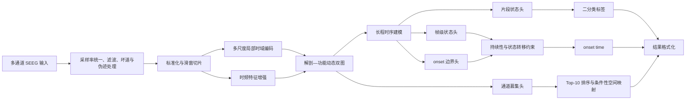

# 基于 SEEG 的癫痫发作状态智能检测算法方案

## 文档说明

本方案面向“基于 SEEG 的癫痫发作状态智能检测”竞赛任务，围绕多通道 SEEG 时间序列，建立覆盖信号预处理、发作状态识别、发作起始点定位、关键通道解释和轻量化部署的完整算法体系。方案同时考虑分类性能、跨受试者泛化、定位精度、解释稳定性、推理时延和算力占用。

由于比赛数据格式、采样率、通道配置、片段长度及 onset 标注粒度尚未完全公开，文中首先给出合理工程假设。实际数据到位后，应通过数据审计和患者级交叉验证校准采样率、滤波带宽、窗口长度、模型容量、判定阈值及后处理参数，不将初始参数直接视为最终配置。

## 目录

1. [总体技术路线](#一总体技术路线)
2. [任务难点与设计原则](#二任务难点与设计原则)
3. [数据预处理与样本构建](#三数据预处理与样本构建)
4. [发作状态识别模型设计](#四发作状态识别模型设计)
5. [发作起始点定位方法](#五发作起始点定位方法)
6. [关键通道识别与候选起始网络估计](#六关键通道识别与候选起始网络估计)
7. [推理与部署方案](#七推理与部署方案)
8. [模型轻量化与算力优化](#八模型轻量化与算力优化)
9. [训练验证与消融实验设计](#九训练验证与消融实验设计)
10. [预期优势与风险控制](#十预期优势与风险控制)
11. [最终技术方案摘要](#十一最终技术方案摘要)

---

## 一、总体技术路线

本方案以“发作状态转变与动态传播联合建模”为核心，构建“质量感知预处理—多尺度表征学习—状态与边界识别—早期募集和传播建模—关键通道排序—轻量化部署”的端到端检测体系。模型不把发作理解为瞬时的二值切换，而是刻画发作间期背景、短暂异常、发作起始及早期募集、后续传播和广泛同步之间的时间演化。共享通道编码器提取局部波形与节律变化，时频分支描述持续性频谱演化，解剖—功能动态图刻画通道募集及传播方向，联合输出片段概率、帧级状态概率、onset 边界概率和通道募集强度。

整体技术路线如下：



状态识别、起始点定位和通道排序在统一机制链上联合学习。帧级状态头判断某一时刻是否处于发作状态，边界头定位状态转变，通道募集头估计各通道在 onset 附近被异常募集的时间和强度；片段标签与概率由状态序列聚合得到，onset 由状态和边界证据联合确定，Top-10 则由早期募集、持续演化和网络传播特征产生。坐标和个体影像可用时，再将接点级结果条件性映射到三维空间和脑区；缺少空间数据时不影响比赛基本输出。该设计避免将通道解释降为分类完成后的附加可视化。

### 1.1 数据条件的合理假设

| 项目 | 初始假设 | 数据到位后的校准方式 |
|---|---|---|
| 数据组织 | 每个样本包含通道 ID、采样率及形状为 `C × T` 的波形 | 编写数据审计程序核验张量方向、单位、缺失值和通道命名规则 |
| 采样率 | 原始采样率不低于 256 Hz，可能存在多种采样率 | 统计全量采样率分布，选择 256 Hz 或 512 Hz 统一建模 |
| 信号单位 | 以 μV 或可换算为 μV 的物理量存储 | 结合元数据与幅值分位数核验，不根据文件类型直接推断 |
| 工频 | 数据以 50 Hz 工频为主 | 根据功率谱峰值自动识别 50/60 Hz，并与采集元数据核对 |
| 通道数 | 不同患者或样本的通道数可能不同 | 使用通道掩码、共享通道编码器和可变长通道聚合 |
| 片段长度 | 样本长度可能固定，也可能变化 | 统一采用滑窗推理，末端补齐并记录有效长度掩码 |
| 标签粒度 | 至少包含片段级标签，部分或全部发作样本具有 onset 标注 | 按标注粒度选择强监督、弱监督或伪标签定位策略 |
| 数据划分 | 同一患者可能包含多个样本或多次发作 | 训练、验证和测试均以患者为最小隔离单元 |
| 空间信息 | 通道 ID 必有，三维电极坐标可能缺失 | 有坐标时加入空间邻接；无坐标时使用信号相关动态图 |
| 影像与解剖信息 | 术前 MRI、术后 CT、脑区标签及 DWI 可能不提供 | 按数据可用性逐级启用接点解剖映射、脑区聚合或研究性结构先验 |
| 输出格式 | 每个样本输出标签、概率和 Top-10；阳性样本输出 onset | 以官方提交模板和评测脚本为最终格式依据 |

数据到位后，首先统计采样率、片段时长、通道数、幅值单位、缺失比例、工频峰值、类别比例、患者样本量、发作持续时间和 onset 标注精度。预处理带宽、窗口长度、输出帧率及模型容量均依据审计结果重新确定。

### 1.2 医学机制与算法设计映射

本任务需要区分发作间期短暂异常与具有持续演化、早期募集和网络传播特征的发作活动。棘波、尖波或孤立 HFO 可以出现在发作间期，单纯能量阈值或单帧高概率不足以支持发作判断；同样，发作传播期振幅最大的通道也未必是最早募集通道。因此，模型以状态转变和传播次序作为主要判别依据。

| 临床电生理认识 | 算法响应 |
|---|---|
| 发作间期可出现棘波、尖波和短暂 HFO | 建立困难负样本库，以持续性、节律演化和跨帧状态约束排除孤立异常 |
| 发作不是瞬间的 0→1 切换 | 设置帧级状态头、onset 边界头及状态转移损失 |
| 起始区、早期募集区与晚期传播区并不等价 | 预测通道—时间募集矩阵，并在内部区分起始候选、早期传播和晚期传播 |
| 波幅最大或分类贡献最高的通道不一定最早 | Top-10 重点纳入 onset 潜伏期、早期演化和传播上游性 |
| SEEG 只记录植入电极覆盖的部分脑网络 | 所有定位结论限定在当前采样覆盖范围内 |
| SOZ、致痫区（EZ）和手术处理区域概念不同 | Top-10 不直接表述为 EZ，也不自动推导切除边界 |

该映射决定模型的学习目标、图结构和通道排序规则。核心创新为发作状态转变与动态传播联合建模；onset 感知的早期通道排序和质量感知的轻量推理作为两项支撑设计。

本方案所述“定位”特指当前 SEEG 植入覆盖范围内的候选发作起始接点与早期传播网络估计，不是传统头皮 EEG/MEG 逆问题意义上的分布式脑源成像。只有在具备接点三维坐标及个体影像时，才将接点级结果映射为脑区级候选分布；不利用有限 SEEG 观测强行推断未植入区域，也不将候选 SOZ 接点直接等同于致痫区（EZ）。

### 1.3 核心技术假设与创新边界

本方案的差异不在于单独使用多尺度卷积、时频分析或图网络，而在于将片段检测、状态边界定位和关键通道排序统一解释为发作状态转变及其跨通道传播过程，并用任务间一致性约束检验该解释。为避免把未经数据验证的结构预设为优势，核心设计按下表进行可证伪验证。

| 编号 | 待验证技术假设 | 核心验证指标 | 假设不成立时的处理 |
|---|---|---|---|
| H1 | 发作前、起始期和传播期的连接变化比静态图更有助于跨患者检测 | 患者宏 F1、PR-AUC、onset MAE、折间方差 | 退化为不含动态图的共享 TCN，不保留无稳定增益的图模块 |
| H2 | onset 专项边界监督优于仅从分类概率后处理得到起点 | onset MAE、平均有符号误差、±1 s/±3 s 命中率 | 保留帧级状态概率、滞回与变化点校正，移除边界头 |
| H3 | 通道忠实性约束能够提高 Top-10 的必要性、充分性和稳定性 | Top-10 遮挡下降、仅保留 Top-10 后的性能保持率、Jaccard/NDCG | 取消训练期忠实性约束，使用募集分数与离线归因校正 |
| H4 | 一次前向快速评分能够近似深度归因的通道排序 | 与遮挡、积分梯度的排名相关性及端到端时延 | 对低一致性病例启用离线深度解释，不将其纳入基础快速链路 |
| H5 | 在坐标和影像可用时，空间约束与接点—脑区映射能够提高跨发作定位一致性和临床可读性 | 接点 Hit@k、空间距离、脑区级 NDCG、跨发作一致性、弃权后错误率 | 关闭脑区级输出，仅保留官方通道 ID、接点排序与传播顺序 |

各假设的保留门槛在查看测试结果前，根据训练折内重复实验和目标硬件预算预先确定。若改善幅度不超过折间随机波动，或以不可接受的时延、校准误差和定位退化为代价，则优先采用较简单模型。QST-DPGNet 仅作为候选模型简称，不以命名本身作为创新性或有效性的依据。

---

## 二、任务难点与设计原则

SEEG 具有通道数量多、采样频率高、空间分布不规则和患者间植入方案不一致等特征。同一发作在不同脑区、不同患者和不同发作阶段可能呈现不同形态；局部低幅快活动、节律性尖波、高频能量上升、谱结构变化和跨通道同步增强均可能构成有效证据，但不存在适用于全部患者的单一波形模板。

跨受试者泛化是首要约束。患者身份、植入位置、参考方式及记录设备可能形成强于疾病状态的统计特征。若模型依赖固定通道序号或患者特有幅值分布，随机样本划分会产生虚高结果。方案因此采用患者级划分、通道共享编码、稳健标准化、通道缺失增强和患者均衡采样，限制模型对固定植入布局和绝对幅值的依赖。

类别不平衡同时存在于患者级、样本级和帧级。发作期样本通常少于发作间期样本；一个阳性片段内，真正发作区间也可能短于背景区间。本方案采用患者—类别双重均衡采样、类别加权损失、困难负样本挖掘和边界加权监督，不使用简单复制少数类样本作为主要平衡手段。

onset 定位要求模型保留足够的时间分辨率。仅对完整片段执行全局池化，即使分类准确，也难以恢复发作起点。方案在网络中保留 8～16 Hz 的帧级输出，通过概率平滑、连续阳性、滞回阈值和变化点检测抑制孤立误报，并显式校正滤波群延迟、滑窗中心位置和补齐区间。

通道贡献与临床起始先后不能混为一谈。晚期传播通道可能具有更大振幅和更高分类贡献，却不是最早募集通道。因此，正式排序以 onset 邻域内的募集潜伏期、持续演化和传播上游性为主，注意力、梯度和遮挡主要承担离线验证作用；结果限定为当前植入覆盖范围内的“片段级重要通道”，不直接解释为发作起始区、致痫区或手术靶点。

低时延推理从网络结构、数据流水线和解释计算三方面共同控制。正式链路采用一次前向得到状态、边界、募集及图外流特征，并通过滤波缓存、STFT 缓存、重叠窗口特征复用和批量推理减少重复计算；积分梯度和遮挡仅用于离线验证。最终以目标硬件上的端到端时延为评价依据，不以单次神经网络前向耗时替代系统耗时。

---

## 三、数据预处理与样本构建

### 3.1 数据审计与泄漏排查

数据到位后先冻结审计程序和患者级划分规则，再开展模型训练。审计表至少包括样本数、患者数、每位患者发作次数、患者级类别比例、通道数、采样率、片段长度、缺失比例、参考方式、设备信息以及 onset 在片段中的位置分布。除总体分布外，还需检查上述字段与标签、患者 ID 的关联，防止模型利用采集流程差异代替电生理证据。

泄漏排查设置三类对照。第一，使用文件哈希、降采样波形指纹和归一化频谱指纹进行重复及近重复检测，并结合聚类结果确认同一连续记录的高度相关片段未跨训练集和验证集。第二，仅使用片段长度、采样率、通道数、文件大小、缺失比例和通道命名等元数据训练简单分类器；若患者级验证性能异常高，应追溯采集或标注流程偏差。第三，在主模型冻结的中间表征上训练患者 ID 探针，评价表征中患者特异信息的可分性。患者 ID 容易预测并不自动证明泄漏，但若同时伴随跨患者性能下降，则需加强患者均衡采样、通道共享编码和稳健标准化；梯度反转式去身份化仅在消融验证有效时启用，以免删除与发作相关的真实个体差异。

对 onset 标注，统计标注时间分辨率、取整方式、相对片段边界的位置以及多专家差异；检查是否存在固定延迟或不同标注者之间的系统偏差。所有近重复阈值、元数据探针和患者身份探针只用于训练数据审计，不根据测试标签调整。审计结果形成版本化报告，并作为确定滤波带宽、窗口长度、分层抽样和评价指标的依据。

### 3.2 重采样与滤波

当原始采样率不低于 512 Hz，且数据中存在稳定的 100 Hz 以上判别信息时，统一重采样至 512 Hz，以保留较高频活动；若原始数据主要为 256 Hz，或比赛算力约束较强，则统一至 256 Hz，并将有效带宽限制在奈奎斯特频率以下。重采样采用带抗混叠滤波的多相 FIR 方法，避免直接抽取造成频谱混叠。

默认带通范围设为 0.5～180 Hz（512 Hz 模式）或 0.5～100 Hz（256 Hz 模式）。高通部分抑制基线漂移，低通部分抑制无效高频噪声。工频处理采用窄带 IIR 陷波或频域自适应抑制，在 50 Hz 及落入有效带宽的谐波处设置陷波；若数据来自 60 Hz 工频环境，则按功率谱峰值自动切换。

分类任务可以比较离线零相位滤波与因果滤波，但 onset 定位必须单独核验边界泄漏。正式方案优先采用线性相位 FIR 并补偿群延迟，或使用因果 IIR 并标定系统延迟，防止滤波器将发作后信息扩散至 onset 之前。片段边缘采用反射补齐，补齐区域不参与帧级损失和 onset 搜索。

### 3.3 坏道检测与伪迹处理

对每个通道计算缺失值比例、恒定值比例、幅值中位绝对偏差、峰峰值、饱和比例、线噪声比、谱熵以及与其他通道的相关性。出现长时间恒定、严重缺失、幅值显著偏离患者内分布、工频能量异常集中或持续削顶的通道标记为疑似坏道。

坏道不直接从张量中删除，而是生成通道有效掩码。短时缺失可采用线性或样条插值；整段失效通道置零并由掩码阻断其图连接、注意力和池化贡献。训练阶段随机执行通道丢弃，以提高模型对测试时通道缺失的适应能力。

肌电、运动、电极爆裂等伪迹通过幅值突变、宽带同步增能、高频谱斜率和通道一致性联合识别。疑似伪迹帧保留质量评分，而不直接删除全部高频活动，因为发作起始本身可能表现为低幅快活动。质量评分作为模型附加输入，并用于调整 onset 触发阈值。

### 3.4 参考重构

若原始数据已使用统一参考，首先保留该版本作为基线。随后比较共同平均参考、稳健共同平均参考和双极参考。稳健共同平均参考仅使用质量合格通道，并采用截尾均值降低异常通道影响。若通道命名能够恢复同一电极杆上的接点顺序，则构建相邻接点双极导联。

双极参考有助于抑制远场共同成分，但会改变通道 ID 语义。Top-10 必须严格输出官方输入和提交模板定义的通道 ID：若官方通道本身为双极导联，则直接保留双极 ID；仅当官方要求输出物理接点且提供单极—双极映射时，才将双极归因分配回原始接点。具体映射规则在数据审计后固化，禁止用模型内部索引替代官方 ID。

### 3.5 幅值标准化

采用患者内或片段内的稳健标准化：

$$
\tilde{x}_{c,t}=
\mathrm{clip}\left(
\frac{x_{c,t}-\mathrm{median}(x_c)}
{1.4826\,\mathrm{MAD}(x_c)+\varepsilon},
-q,q
\right),
$$

其中，$q$ 初始取 8～12。若提供足够长的患者基线，优先使用患者发作间期统计量；若测试患者完全未知，则使用片段内稳健统计量，并将原始对数幅值尺度作为附加特征，避免标准化完全抹去具有判别力的幅值变化。

### 3.6 滑窗切片与标签对齐

主分类窗口初始设为 4 s，步长设为 0.5 s，模型内部保持约 0.125 s 的输出帧间隔。4 s 窗口通常能够覆盖节律演化，同时不会使局部发作证据被过长背景稀释。若数据审计显示典型发作演化较慢，可增加 8 s 上下文分支，但仍保留高分辨率帧级输出。

窗口标签不采用“只要包含一个发作采样点即判为阳性”的简单规则，而根据窗口内发作占比和 onset 位置设置。发作占比高于阈值 $r_+$ 的窗口作为片段级阳性；完全位于发作间期且距 onset 超过安全间隔的窗口作为阴性；跨越边界但发作占比较低的窗口保留帧级标签，同时降低片段级损失权重。发作前期是否作为阴性应严格依据比赛定义，不能与发作预测或预警任务混用。

帧级监督按照标注条件分级实施。若同时提供 onset 和 offset，则构建完整状态分割标签，并对两个边界分别设置软标签；若只提供 onset，则边界头接受强监督，onset 后状态头仅在能够确定的区间接受部分标签监督，其余区间通过多实例约束学习；若只有片段标签，则采用多实例学习和一致性正则，不宣称模型获得了充分的精确定位监督。基于能量变化生成的募集伪标签仅作为辅助训练信号，不作为临床真值。

训练、验证、交叉验证均以患者为最小划分单位。同一患者的不同发作、相邻切片和增强样本不得跨集合。超参数选择及概率校准只能使用训练折内的患者级验证集。

### 3.7 跨受试者数据增强

增强方式包括幅值缩放、低强度有色噪声、随机时间遮挡、频带遮挡、随机通道丢弃、通道顺序扰动、轻微基线漂移和局部增益变化。时间拉伸、裁剪或拼接会改变 onset，只有在同步变换帧级标签和 onset 标注时才使用。频率平移幅度应严格受限，避免破坏具有临床含义的节律位置。

Mixup 仅在相同参考方式、相近采样条件和相同标签类别内使用。具有 onset 标注的发作样本不采用会破坏边界语义的普通 Mixup。所有增强强度通过患者级验证集确定，并同时检查 Recall、Specificity 和 onset MAE。

### 3.8 电极坐标与解剖映射（条件模块）

若官方提供已质控的接点三维坐标和脑区标签，直接采用官方定义并保留坐标系、单位及通道 ID 映射，不另行重定位。若同时提供术前 T1 MRI 与术后 CT，则执行 CT–MRI 刚体配准、接点中心提取、个体脑分区映射和人工质控；必要时评估金属伪影、配准误差及接点位于灰质、白质或脑区边界的情况。每个接点除坐标外，还记录脑区归属权重和定位不确定度，避免把边界接点强制分配给单一脑区。

接点解剖映射属于条件性输入处理，不改变仅有波形和通道 ID 时的基本推理链路。训练、验证和测试使用相同的坐标系及脑区字典；标准空间坐标不能替代个体影像质控。若配准误差超过预设阈值、通道—坐标对应关系不完整或影像来源无法核验，则关闭脑区级输出，仅保留官方通道 ID 的接点级排序。

---

## 四、发作状态识别模型设计

### 4.1 输入张量

单个模型窗口表示为：

$$
X\in\mathbb{R}^{B\times C\times T},
$$

其中，$B$ 为批量大小，$C$ 为有效通道数，$T=L\cdot f_s$。模型同时接收通道有效掩码 $M\in\{0,1\}^{B\times C}$、帧有效掩码，以及可选的电极坐标、接点—脑区软映射和坐标质量评分。不同样本通道数不一致时，在批次内补齐至最大通道数；补齐通道不参与归一化、图连接、池化和损失计算。空间信息缺失时采用显式掩码，不以零坐标伪装为真实解剖位置。

### 4.2 主模型架构：QST-DPGNet

主模型命名为质量感知的 SEEG 状态转变与动态传播网络 QST-DPGNet（Quality-aware State Transition and Dynamic Propagation Graph Network）。其核心不是叠加多种通用模块，而是用共享表征联合回答三个问题：何时由背景转入发作、哪些通道最先被募集、异常活动如何在已植入通道之间传播。

#### 4.2.1 局部时域特征提取

各通道共享同一组一维卷积参数，避免模型记忆固定通道编号。时域编码器由三条深度可分离卷积分支构成，其感受野分别覆盖短时尖波、中等节律和慢速形态变化。在 512 Hz 下，可采用 7、31、127 点卷积核，后接逐点卷积、归一化、SiLU 激活和残差连接。

共享编码器将各通道投影至统一表征空间。深度可分离卷积降低参数量，多尺度卷积避免仅用固定波形宽度描述发作形态，适合 SEEG 中尖波、快速活动和缓慢节律演化并存的情况。

#### 4.2.2 时频特征增强

时频分支采用可微滤波器组或 STFT 对数功率特征。初始频带包括 δ、θ、α、β、低 γ 和高 γ，并增加工频邻域质量特征。对于 512 Hz 数据，可评估 80～180 Hz 频段，但仅在抗混叠和伪迹控制可靠时纳入主模型。

时频特征经轻量二维卷积或逐频带线性映射后，与时域特征在相同帧率下进行门控融合：

$$
H_{c,k}=
G_{c,k}\odot H^{\mathrm{time}}_{c,k}
+(1-G_{c,k})\odot H^{\mathrm{tf}}_{c,k}.
$$

该结构既保留从原始波形学习非预设形态的能力，也显式提供节律性增能和频谱迁移证据。

#### 4.2.3 解剖—功能动态双图

通道关系由静态解剖图和时变功能图构成：

$$
A_t=\lambda_aA^{\mathrm{anatomy}}+\lambda_fA_t^{\mathrm{functional}}.
$$

静态解剖图 $A^{\mathrm{anatomy}}$ 由电极空间距离、同一电极杆相邻关系和可选脑区信息构建；时变功能图 $A_t^{\mathrm{functional}}$ 由滞后相关、相位滞后指标和特征驱动的有向连接共同估计。相较仅使用对称相关或相干性，有向滞后关系能够提供“先募集—后响应”的传播线索。共同参考可能放大零时滞相关，因此零时滞同步只作为辅助边权，不直接解释为传播方向。

图网络分别汇总发作前基线、onset 早期和传播阶段的关系，重点学习相对基线的结构变化：

$$
\Delta A_t=A_t-A_{\mathrm{baseline}}.
$$

基线优先取同一片段内 onset 前的质量合格区间；片段不含足够基线时，依次使用该患者独立发作间期统计量和仅由训练集构建的分层参考原型，禁止由测试标签反推基线。每个节点只保留 Top-$k$ 有效邻居，并保留节点自身残差，兼顾计算效率与局灶活动。若没有三维坐标或脑区标签，则删除解剖图分支，将模型明确表述为“信号驱动的动态功能图”，不推断未被电极采样的脑区，也不声称完成解剖意义上的脑源定位。

通道 ID 默认不作为固定嵌入直接输入模型，避免在跨患者条件下形成通道编号依赖。只有训练集和测试集共享严格一致的电极定义时，才将通道 ID 作为弱辅助信息。

#### 4.2.4 长程时序依赖建模

通道特征经掩码注意力池化形成帧序列 $Z\in\mathbb{R}^{B\times K\times D}$。长程建模采用扩张深度可分离 TCN 与轻量门控注意力组合。TCN 处理局部至中长程节律演化，线性复杂度注意力补充较远时间位置之间的依赖。

与完整 Transformer 相比，该结构对长 SEEG 序列的内存开销更低，部署算子更稳定，也更适合 ONNX、TensorRT 和 CPU 推理。网络保持固定帧率，不在中间层过早执行全局池化。

#### 4.2.5 状态—边界—募集联合输出头

模型设置帧级状态、onset 边界和通道募集三个时间级输出：

$$
p_t^{\mathrm{state}}=\Pr(t\text{ 时刻处于发作状态}),
$$

$$
p_t^{\mathrm{onset}}=\Pr(t\text{ 时刻为发作转变边界}),
$$

$$
r_{c,t}=\Pr(\text{通道 }c\text{ 在时刻 }t\text{ 被异常募集}).
$$

片段概率由质量加权的状态序列池化产生：

$$
p_{\mathrm{clip}}=
\sigma\left(
W_c\sum_k\alpha_kZ_k+b_c
\right).
$$

片段概率不直接取帧概率最大值，以降低单个棘波或伪迹帧导致整段误判的风险。状态头与边界头联合产生 onset，募集头同时保留通道维与时间维，用于区分早期募集和后续传播。三者通过一致性约束连接：高边界概率之后应出现持续的状态概率上升；通道募集活动应在候选 onset 附近出现，并在传播期形成合理的时序扩展。

### 4.3 损失函数

联合损失定义为：

$$
\mathcal{L}=
\lambda_1\mathcal{L}_{\mathrm{clip}}
+\lambda_2\mathcal{L}_{\mathrm{state}}
+\lambda_3\mathcal{L}_{\mathrm{onset}}
+\lambda_4\mathcal{L}_{\mathrm{transition}}
+\lambda_5\mathcal{L}_{\mathrm{recruit}}
+\lambda_6\mathcal{L}_{\mathrm{fidelity}}
+\lambda_7\mathcal{L}_{\mathrm{reg}}.
$$

其中，片段损失采用类别加权 BCE 或非对称 Focal Loss；状态损失按可用标注采用 Focal BCE 与 Soft Dice；onset 损失使用以专家标注为中心的窄高斯软标签，降低逐帧硬边界对标注差异的敏感性；状态转移损失惩罚孤立高概率和不合理的频繁切换，并约束边界后具有最小持续时间；募集损失对通道弱标签或人工标注进行学习；忠实性损失使 Top-10 排序成为直接优化目标；正则项包括动态图稀疏、方向一致性和权重衰减。

若没有通道—时间真值，则以 onset 邻域相对基线的持续频谱变化、线长变化和跨通道时滞生成弱募集标签，并以多视图一致性限制伪标签噪声。传播头属于辅助学习任务，其输出只用于排序和证据组织，不将弱标签描述为临床真值。若只有片段标签，则采用多实例学习，且在报告中明确定位监督不足。

#### 4.3.1 Top-10 忠实性约束

训练期由募集头产生软通道门控 $g_c\in[0,1]$，并以 $X\odot g$ 表示主要保留高分通道的输入，以 $X\odot(1-g)$ 表示抑制高分通道后的输入。充分性损失要求保留高分通道后仍能维持原始判断：

$$
\mathcal{L}_{\mathrm{suff}}=
\left|\mathrm{sg}[z(X)]-z(X\odot g)\right|,
$$

其中 $\mathrm{sg}$ 表示停止梯度，避免原始分支为缩小差值而反向适配软门控。

必要性损失要求移除高分通道后，阳性样本的发作 logit 至少下降给定间隔 $m$：

$$
\mathcal{L}_{\mathrm{nec}}=
\max\left(0,\,
m-[z(X)-z(X\odot(1-g))]
\right).
$$

稳定性损失约束原始样本与轻微噪声、时间偏移或通道丢弃样本 $\tilde X$ 的软排序一致：

$$
\mathcal{L}_{\mathrm{stable}}=
D\left(S(X),S(\tilde X)\right),
$$

其中 $D$ 可采用 Jensen–Shannon 散度或可微排序距离。为防止门控退化为保留全部通道，增加目标基数约束 $\left(\sum_c g_c-k\right)^2$，其中 $k=\min(10,C_{\mathrm{valid}})$。忠实性损失定义为三项及基数约束的加权和，主要用于阳性样本；阴性样本采用类别对应的判别充分性约束，不赋予起始区含义。

训练时先在不使用忠实性损失的条件下完成表征预热，再逐步增加 $\lambda_6$。为控制训练成本，软门控主要作用于可复用的逐通道编码特征，并在部分批次上计算；验证阶段再以原始输入遮挡核验其真实性。在缺乏通道真值时不直接使用不可微硬 Top-k，以免早期伪相关被固定。若加入忠实性约束后分类、onset 或跨患者稳定性退化，或其遮挡效果不优于随机通道，则依据 H3 退出条件移除该损失。

### 4.4 训练策略

训练采用 AdamW 优化器、余弦退火和前若干 epoch 的线性预热。批次采样同时平衡患者与类别，防止样本量较大的患者主导梯度。可先训练时域和时频编码器，再加入通道图与帧级定位头联合微调；若数据规模充足，则直接端到端训练。

困难负样本挖掘重点纳入电极爆裂、运动伪迹、睡眠尖波和周期性放电等易误判片段。早停依据患者宏平均 AUC、F1 和 onset MAE 的综合指标，而非窗口级准确率。

### 4.5 概率校准

模型训练完成后，在完全独立的患者级校准集上执行温度缩放：

$$
p^{\mathrm{cal}}=\sigma(z/T).
$$

若校准样本量充足且可靠性曲线呈明显非线性，可比较向量温度缩放和保序回归。最终分类阈值 $\tau$ 依据比赛主指标、灵敏度约束和患者级验证结果确定，不预设为 0.5。输出概率使用校准后的数值并四舍五入至 6 位小数；标签由未舍入概率与阈值比较得到。

---

## 五、发作起始点定位方法

### 5.1 状态与边界概率重建

对长片段执行重叠窗口推理后，同一时间帧可能获得多个状态概率和边界概率。两类序列分别采用窗口中心加权方式融合：

$$
\bar p_k=
\frac{\sum_w q_{w,k}p_{w,k}}
{\sum_w q_{w,k}+\varepsilon},
$$

其中 $q_{w,k}$ 为三角形或 Hann 权重，使窗口边缘的低可靠预测贡献较小；边界概率采用相同方法得到 $\bar b_k$。滤波群延迟、模型感受野中心偏移及重采样时间映射在此阶段统一补偿。

### 5.2 概率平滑与阈值滞回

首先对 $\bar p_k$ 进行 0.25～0.75 s 中值滤波，去除孤立尖峰；随后使用指数移动平均或一维高斯滤波。平滑尺度通过患者级验证确定，避免过强平滑造成 onset 系统性延后。

状态机采用双阈值滞回机制。高阈值 $\tau_h$ 用于触发候选发作，低阈值 $\tau_l$ 用于维持发作状态，且 $\tau_h>\tau_l$。候选 onset 需满足：状态概率越过高阈值；边界概率在前后容忍区间内存在局部峰值；后续至少 $D_{\min}$ 秒内大部分帧高于低阈值；候选区间平均概率和上升斜率达到最低要求；低质量伪迹帧不能独立触发发作。

连续阳性约束用于抑制短暂尖波、电极爆裂和单帧模型波动。$\tau_h$、$\tau_l$ 和 $D_{\min}$ 均由训练折内部验证确定。

### 5.3 联合边界判定与变化点校正

状态概率确定发作持续区间，边界概率提供状态转变的直接定位证据。候选区间内首先计算联合边界分数：

$$
B_k=\rho_1\bar b_k
+\rho_2\Delta\mathrm{logit}(\bar p_k)
+\rho_3\max_c r_{c,k}
-\rho_4Q_k^{\mathrm{artifact}},
$$

其中 $r_{c,k}$ 为通道募集强度，$Q_k^{\mathrm{artifact}}$ 为伪迹风险。选择满足后续状态持续性约束的最早显著峰值作为初始 onset。变化点检测不再承担主要定位任务，而作为边界头的独立校正证据。在初始 onset 前的限定区间内构造：

$$
R_k=
w_p\Delta\mathrm{logit}(\bar p_k)
+w_e\Delta E_k
+w_s\Delta S_k,
$$

其中，$\Delta E_k$ 表示判别频带能量相对基线的变化，$\Delta S_k$ 表示动态功能图相对基线的变化。工程实现固定使用经验证表现最优的一种变化点算法；CUSUM 和 PELT 仅作为消融候选，不在正式链路中并行运行。最终 onset 由状态持续区间、边界峰值和变化点证据联合确定，不采用“首次超过 0.5”作为唯一规则。

时间输出为：

$$
t_{\mathrm{onset}}=
\max\left(0,\frac{k^*}{f_{\mathrm{frame}}}-d_{\mathrm{system}}\right),
$$

其中 $d_{\mathrm{system}}$ 为滤波和模型引入的标定延迟。输出数值精度与模型实际时间分辨率需区分；例如帧间隔为 0.125 s 时，即使结果格式保留三位小数，也不能据此声称达到毫秒级定位精度。

### 5.4 异常片段处理与定位置信度

若最终标签为 0，则 onset 输出空值、`null` 或官方规定的占位符。若标签为 1 且首帧已持续处于高概率状态，说明发作可能在片段开始前发生，此时 onset 置为 0，并在内部记录 `left_censored=true`。若高概率区仅位于补齐区域，则不得将其作为 onset。

定位置信度综合考虑阈值裕量、持续时间、概率上升斜率、变化点显著性及重叠窗口一致性：

$$
Q_{\mathrm{onset}}=
\eta_1Q_{\mathrm{margin}}
+\eta_2Q_{\mathrm{duration}}
+\eta_3Q_{\mathrm{change}}
+\eta_4Q_{\mathrm{agreement}}.
$$

若提交格式不允许输出置信度，该值仍保留在内部日志中，用于错误分析和临床辅助场景下的低置信提示。

---

## 六、关键通道识别与候选起始网络估计

比赛要求输出对当前片段最重要的 10 个通道。对阳性样本，本方案不以整段分类贡献或最大振幅直接排序，而以 onset 邻域内的早期性、持续演化和传播上游性为主要依据，避免晚期广泛同步通道占据全部名额。内部同时保留“起始候选—早期传播—晚期传播”分层，比赛提交时再按统一评分输出 Top-10。

### 6.1 onset 感知的证据窗口

阳性样本的主要评分区间限定为：

$$
\mathcal{W}_{\mathrm{early}}=
[t_{\mathrm{onset}}-\delta_1,\,
t_{\mathrm{onset}}+\delta_2],
$$

其中 $\delta_1$ 用于覆盖边界标注误差及 onset 前最早变化，$\delta_2$ 限制晚期传播影响，初值分别可设为 1～2 s 和 3～5 s。若片段左删失或 onset 置信度较低，则扩大时间窗并降低早期性项权重。晚期区间只用于判断传播层级，不参与起始候选的主要排序。

### 6.2 快速通道评分

正式提交和准实时推理采用一次模型前向即可获得的证据：

$$
S_c=
w_1E_c^{\mathrm{early}}
+w_2L_c^{\mathrm{latency}}
+w_3D_c^{\mathrm{evolution}}
+w_4P_c^{\mathrm{outflow}}
+w_5R_c^{\mathrm{repeat}}
+w_6M_c^{\mathrm{model}}
-w_7Q_c^{\mathrm{artifact}}.
$$

其中：

- $E_c^{\mathrm{early}}$ 为 onset 邻域内的募集强度及相对基线异常幅度；
- $L_c^{\mathrm{latency}}$ 为通道首次持续募集相对全局 onset 的潜伏期，激活越早得分越高；
- $D_c^{\mathrm{evolution}}$ 描述节律持续性、频率迁移、振幅演化和线长变化，用于区别发作演化与孤立棘波；
- $P_c^{\mathrm{outflow}}$ 为动态有向功能图中的净外流及其相对基线增量，用于识别传播上游通道；
- $R_c^{\mathrm{repeat}}$ 为同一患者多次发作间的排名一致性；单次发作或未知患者时该项置为中性，不以缺失信息惩罚；
- $M_c^{\mathrm{model}}$ 为募集头置信度和轻量注意力贡献；
- $Q_c^{\mathrm{artifact}}$ 为坏道、饱和、工频和宽带伪迹风险。

各分量采用样本内百分位秩归一化，权重由患者级验证集学习或网格搜索确定，并设置非负与和为 1 的约束。任何单一能量指标均不得主导总分。评分后先剔除无效通道，再按 $S_c$ 从高到低输出官方定义的通道 ID。

对阴性样本，比赛若仍要求 Top-10，则输出“对发作间期判定最具信息量且质量可靠的通道”，评分由状态头贡献、背景稳定性和低伪迹风险构成；该排序不使用 onset 潜伏期，也不解释为起始区候选。

### 6.3 起始与传播分层

根据募集时间 $t_c^{\mathrm{recruit}}$ 和动态图方向，将阳性通道在内部划分为：onset 容忍区间内首先持续激活且具有较高净外流的起始候选；随后短延迟激活的早期传播通道；以及在广泛同步阶段才激活的晚期传播通道。比赛输出仍为统一 Top-10，但临床复核报告展示分层结果及每个通道的募集潜伏期，避免把晚期传播等同于起始。

### 6.4 离线归因验证

Integrated Gradients、SmoothGrad 和通道遮挡不进入每个测试样本的正式低时延链路，而用于模型验证和疑难病例复核。遮挡贡献定义为：

$$
O_c=z(X)-z(X_{\setminus c}).
$$

在验证集上检查快速评分 Top-$k$ 通道被遮挡后，片段 logit、边界概率和募集一致性是否显著下降，并与随机通道遮挡比较；积分梯度用于核验模型是否依赖 onset 早期而非片段末端。若快速评分与离线归因长期不一致，则调整募集头监督和评分权重，而不是在正式推理中堆叠全部归因方法。

### 6.5 稳定性与临床可读性

在轻微噪声、时间偏移和通道缺失扰动下重复评估，使用 Top-10 Jaccard、Spearman/Kendall 相关和 onset 潜伏期方差衡量稳定性。同一患者存在多次发作时，另计算跨发作重复性；分数接近时优先选择早期持续出现、图外流稳定且质量可靠的通道。

Top-10 只表示当前植入覆盖范围内、与本次记录状态转变相关的重要通道。有效通道少于 10 个时不伪造通道，按官方规则补空值或无效占位符。算法结果不自动定义 SOZ、EZ 或手术切除范围。

### 6.6 空间约束与脑区级聚合（条件模块）

在具备可靠接点坐标时，将欧氏距离、同一电极杆关系和可选脑区邻接作为静态空间先验，与时变功能图共同约束传播路径。空间先验不覆盖信号证据：较远接点之间若存在稳定的有向传播关系仍可保留连接，近邻接点也不能仅因距离接近而被判为共同起始。

在具备 CT–MRI 配准和个体脑区映射时，将接点分数聚合为脑区级候选分数：

$$
S_r^{\mathrm{ROI}}=
\frac{\sum_c\omega_{c,r}\,q_c^{\mathrm{coord}}\,\sigma(S_c)}
{\sum_c\omega_{c,r}\,q_c^{\mathrm{coord}}+\varepsilon},
$$

其中 $\omega_{c,r}$ 为接点 $c$ 属于脑区 $r$ 的软映射权重，$q_c^{\mathrm{coord}}$ 为坐标和配准质量，$S_c$ 为接点级综合评分。若没有人工 SOZ 脑区标签，$S_r^{\mathrm{ROI}}$ 只能称为候选分数；只有经患者级校准和独立验证后，才可表述为概率。脑区聚合用于临床复核报告，不改变比赛必须输出的原始 Top-10 通道 ID。

根据可用数据，定位能力按下表分级启用：

| 可用数据 | 可实现输出 | 明确限制 |
|---|---|---|
| SEEG 波形和通道 ID | 候选起始通道、募集顺序、早期传播关系 | 不能称为严格脑源成像，不能定位未覆盖脑区 |
| 接点三维坐标 | 空间约束动态图、接点级三维传播路径 | 只描述已植入接点之间的空间关系 |
| 术前 MRI、术后 CT 和解剖分区 | 接点—脑区映射、脑区级候选分数及空间展示 | 结果受配准、分区和植入覆盖范围限制 |
| 专家 SOZ 标注 | 接点或脑区级监督与概率校准 | 标签存在阅图者差异，需多专家或裁决标准 |
| 实际处理区域及术后结局 | 定位结果与临床疗效的回顾性关联验证 | 处理区域不等同于真实 EZ，不能据此单独证明因果性 |
| MRI、DWI 和结构连接组 | 患者特异性结构先验或研究性生物物理模型 | 数字孪生、虚拟切除不进入本竞赛主流程 |

### 6.7 定位不确定性与弃权机制

定位置信度综合 onset 不确定性、通道排名扰动稳定性、跨发作一致性、坐标配准误差和植入覆盖充分性：

$$
Q_{\mathrm{loc}}=
f(Q_{\mathrm{onset}},Q_{\mathrm{rank}},Q_{\mathrm{repeat}},
Q_{\mathrm{coord}},Q_{\mathrm{coverage}}).
$$

其中覆盖充分性只评价“现有接点是否形成稳定、可解释的早期上游模式”，不能证明未覆盖脑区不存在真实起始源。出现接点坐标缺失、配准误差超限、多个候选区域分数接近、不同发作定位不一致、严重伪迹或无稳定上游接点时，系统停止输出脑区级肯定结论，并提示“定位证据不足，需复核植入覆盖与原始波形”。比赛若强制输出 Top-10，仍按官方格式给出通道排序，但内部低置信标记必须保留，且不得将强制输出解释为可靠定位。

$Q_{\mathrm{loc}}$ 的各分量统一归一化至 $[0,1]$，函数 $f$ 采用具有单调约束的逻辑模型或保序校准，并只在患者级验证集上拟合。没有可靠空间参考标准时，$Q_{\mathrm{loc}}$ 仅称为定位质量指数，不表述为“定位正确概率”。

---

## 七、推理与部署方案

### 7.1 完整推理流水线

正式推理包含以下环节：

1. 读取样本及元信息，核验采样率、通道 ID、张量方向、数值类型和有效长度。
2. 执行重采样、滤波、质量检测、参考重构和稳健标准化。
3. 生成重叠滑窗、通道掩码及帧有效掩码。
4. 批量执行模型前向，获得片段概率、帧级状态概率、边界概率、通道募集矩阵和动态图外流特征。
5. 融合窗口结果并执行概率校准，得到最终发作概率和二分类标签。
6. 对状态与边界序列执行平滑、滞回、连续阳性和变化点校正；仅对阳性样本输出 onset。
7. 在 onset 早期窗口融合募集强度、潜伏期、演化性、图外流和质量惩罚，单次前向生成 Top-10 通道 ID。
8. 若坐标和影像映射可用且通过质控，生成接点级三维传播路径、脑区候选分数和定位置信度；否则跳过该条件模块。
9. 按官方模板完成字段、数值精度、通道顺序和缺失值格式化，并运行提交校验程序。

建议的中间结果结构如下：

```json
{
  "sample_id": "sample_xxx",
  "label": 1,
  "probability": 0.873421,
  "top10_channels": ["A3", "A4", "B2", "A2", "C7", "B3", "D1", "C6", "A5", "D2"],
  "onset_time": 12.375
}
```

实际字段名称、分隔符和空值表达以官方模板为准。概率先校准、后格式化；标签使用未舍入概率判定，避免临界概率因六位小数截断而与标签不一致。

### 7.2 快速推理与深度解释分层

比赛正式提交和准实时筛查采用快速链路，只使用模型一次前向产生的状态、边界、募集和动态图特征，以及可缓存的时频与质量指标。该链路输出比赛要求的全部字段，不依赖反向传播或逐通道重复前向。

离线验证和临床疑难片段复核可启用深度解释链路，执行 Integrated Gradients、SmoothGrad、通道遮挡和多扰动稳定性分析。两套链路的作用不同：快速链路满足时延约束，深度解释链路验证快速通道排序是否可信，不将后者的计算成本计入基础模型前向耗时，但在完整临床系统评估中单独报告。

### 7.3 GPU 部署

GPU 模式采用 FP16 或 BF16 混合精度，窗口按样本动态批处理。预处理尽量采用向量化 CPU 实现并使用固定内存缓存，模型输入通过 pinned memory 异步传输。深度解释模式需要遮挡时，将候选组成扩展 batch 一次前向，但该步骤不进入正式快速链路。

### 7.4 CPU 部署

CPU 模式优先使用深度可分离卷积、稀疏 Top-$k$ 图和 TCN，限制全局自注意力规模。通过 ONNX Runtime 或 OpenVINO 执行算子融合、线程绑定和 INT8 推理。STFT、滤波和窗口生成使用连续内存布局，避免在通道维反复复制。

### 7.5 时延与内存控制

推理耗时分解为数据读取、预处理、模型前向、onset 后处理、通道解释和结果格式化六部分。分别报告冷启动和稳态耗时，并给出 P50、P95，而不只报告单次最优值。

内存侧采用流式读取、滑窗环形缓存和按块推理，不将超长记录的所有窗口一次性展开。重叠窗口共享滤波结果、STFT 帧和局部编码特征。在未明确比赛硬件前，不预设绝对毫秒级目标；模型定型后应在目标环境进行批量大小、线程数和精度模式的联合寻优。

### 7.6 异常输入处理

对空文件、NaN/Inf、采样率缺失、通道重复、通道数不足、片段过短和极端幅值设置确定性处理规则。无法恢复的通道置无效掩码；片段过短时反射补齐，并禁止在补齐区域输出 onset；全部通道失效时输出低置信默认结果和错误码，避免程序崩溃或生成非数值概率。

---

## 八、模型轻量化与算力优化

轻量化不与核心模型创新并列。正式优化主线限定为“教师—学生蒸馏、混合精度或 INT8、滑窗缓存复用”三项；结构化剪枝、低秩分解仅在目标硬件基准显示存在实际瓶颈时启用，避免形成与收益无关的技术堆叠。

首先训练完整教师模型，再训练轻量学生模型。学生模型保留共享时域编码、频带增强和帧级输出，但减少通道图层数、隐藏维度和时序块数量。蒸馏目标包括片段 logit、帧级概率、中间时序特征及通道排名：

$$
\mathcal{L}_{\mathrm{KD}}=
\alpha\mathcal{L}_{\mathrm{logit}}
+\beta\mathcal{L}_{\mathrm{frame}}
+\chi\mathcal{L}_{\mathrm{feature}}
+\delta\mathcal{L}_{\mathrm{rank}}.
$$

通道排名蒸馏用于限制模型压缩后的解释漂移。若蒸馏后仍不能满足算力预算，再采用结构化剪枝，剪枝对象限定为卷积输出通道、注意力头和图层宽度，并在每轮剪枝后微调。非结构化稀疏若不能在目标硬件获得实际加速，不纳入正式方案。

CPU 部署优先量化卷积和线性层至 INT8；归一化、Softmax、概率输出和 onset 后处理保留 FP16 或 FP32。若静态量化导致低幅发作特征损失，则采用量化感知训练，或只量化时域编码器和分类头。

动态图仅保留 Top-$k$ 边，连接估计使用降采样特征。大尺寸线性映射只有在 profiling 证明其为主要耗时来源时才进行低秩分解。通道数较多时，可先以质量评分屏蔽坏道，但不为减少计算而任意删除低幅通道，以免漏掉局灶性起始活动。

连续滑窗共享滤波数据、STFT 帧和部分卷积状态。以 4 s 窗口、0.5 s 步长为例，直接重复编码会产生显著冗余；采用流式编码后，仅需计算新增 0.5 s 数据对应的局部特征。

| 部署场景 | 推荐格式 | 主要优化方式 |
|---|---|---|
| NVIDIA GPU | ONNX + TensorRT | FP16、静态形状桶、算子融合、快速通道评分 |
| x86 CPU | ONNX Runtime / OpenVINO | INT8、线程绑定、图优化、内存复用 |
| PyTorch 环境 | TorchScript | 脚本化预处理、固定推理图、混合精度 |
| 研究复现 | PyTorch + ONNX 双版本 | 保留训练模型并验证导出误差 |

轻量化模型须同时满足分类概率误差、onset 偏移和 Top-10 排名稳定性约束。建议将相对教师模型 AUC 下降不超过 0.5～1.0 个百分点、onset MAE 增幅不超过 10%、Top-10 Jaccard 降幅不超过预设阈值作为初始准入条件，再比较参数量、FLOPs 和端到端时延收益。

---

## 九、训练验证与消融实验设计

### 9.1 实验层级

实验采用“审计基线—强基线—候选主模型—部署模型”四级体系，不预设复杂模型必然最优。

| 层级 | 模型与输入 | 主要作用 |
|---|---|---|
| 审计基线 | 线长、Hjorth 参数、分频带功率、谱熵、峰度、通道相关统计 + LightGBM | 检查数据基本可分性、识别元数据或幅值泄漏、建立可解释性能下界 |
| 强基线 | 多尺度共享 TCN + 掩码通道池化 + 状态输出头 | 检验不使用动态图时的稳健上限，作为复杂结构的主要对照 |
| 候选主模型 | QST-DPGNet：时域—时频编码、动态双图、状态—边界—募集联合头 | 验证状态转变、传播建模和通道忠实性假设 |
| 部署模型 | 经蒸馏及目标硬件优化的学生模型 | 在分类、onset 和排序退化受控的条件下降低时延和内存 |

手工特征基线和强基线使用与主模型完全相同的患者级数据划分、窗口定义和概率校准。只有候选主模型在患者级重复验证中稳定超过强基线，改善幅度大于折间波动，且 onset、校准、Top-10 忠实性及推理预算均满足预设门槛时，才进入最终方案；否则采用强基线或删除无稳定增益的模块。

所有模型使用相同的患者级训练、验证和测试划分。数据规模允许时采用五折 GroupKFold；患者数量较少时采用留一患者或重复分组交叉验证。模型选择、阈值优化和概率校准只在训练折内部完成。若数据包含采集时间或中心信息，在患者隔离基础上增加时间外和中心外验证；空间定位结果不得只在参与建模的同中心植入模板上评价。

### 9.2 评估指标

分类指标包括 ROC-AUC、PR-AUC、F1、Recall、Specificity、Balanced Accuracy 和期望校准误差 ECE。类别高度不平衡时，PR-AUC 和患者宏平均 F1 作为重点指标。若提供连续记录，进一步报告事件级敏感性、每小时或每天假阳性事件数及检测延迟；若只有独立片段，则明确说明无法从该数据可靠估计连续监测假警报率。

除总体结果外，报告患者宏平均、患者间标准差和 bootstrap 置信区间，并按发作类型、脑区、MRI 阴性/阳性、植入通道数量和信号质量分层。分层样本不足时只进行描述性分析，不据小样本作确定性结论。

onset 定位报告 MAE、中位绝对误差、误差四分位数、平均有符号误差，以及落在 ±0.5 s、±1 s 和 ±3 s 范围内的比例。平均有符号误差用于识别系统性提前或延迟。左删失、缓慢起始、多起始事件和专家分歧较大的样本分别统计；具备多专家标注时，将模型误差与专家间差异同时报告。

通道排序指标包括 Hit@10、Recall@10、NDCG、平均精确率、Spearman/Kendall 排名相关、扰动稳定性和同一患者不同发作间的一致性。若具备临床资料，分别评价与专家标注 SOZ、实际切除/消融区域及术后结局的关系，不将 EZ 作为可直接观测的术前真值。可进一步检验术后无发作患者中，高排名通道被实际处理的覆盖程度是否高于对照组，但该分析属于回顾性临床关联，不能证明因果性。

空间定位仅在坐标和参考标准可用时评价。接点级报告 Contact Hit@1/5/10、预测峰值至专家起始接点的距离和跨发作空间一致性；脑区级报告 Precision、Recall、NDCG、校准误差及候选脑区覆盖率。定位可靠性同时报告 CT–MRI 配准误差、坐标缺失比例、弃权率以及“保留样本比例—定位错误率”曲线。参考标准按多名癫痫专科医生的独立阅图与裁决、其他影像/症状学证据、实际处理区域和术后结局分层记录，不把单一医生标注或切除范围当作无误差真值。

效率指标包括参数量、MACs/FLOPs、模型文件大小、CPU/GPU 峰值内存、预处理耗时、模型耗时、解释耗时及端到端 P50/P95 时延。

### 9.3 消融实验矩阵

| 消融对象 | 对照设置 | 核心指标 | 保留条件 |
|---|---|---|---|
| 重采样与带宽 | 256 Hz、512 Hz；是否保留高频 | PR-AUC、Recall、时延 | 高频带来跨患者稳定增益，且抗混叠、伪迹风险和时延可接受 |
| 参考方式 | 原始参考、稳健平均、双极参考 | 患者宏 F1、Top-10 稳定性 | 改善不依赖少数患者，官方通道 ID 可无歧义回映 |
| 标准化 | z-score、稳健 MAD、患者基线标准化 | 患者宏指标、最差患者性能 | 降低患者间方差且不削弱低幅起始活动 |
| 时频分支 | 移除时频分支或改用固定频带功率 | PR-AUC、伪迹误报率、时延 | 相对强基线的增益超过折间波动，且误报与时延无明显恶化 |
| 动态传播图 | 无图、静态图、动态功能图、解剖—功能双图 | 患者宏 F1、onset MAE、传播排序 | 至少一个主要任务稳定改善，其他任务无实质退化，计算增幅可接受 |
| 长程模块 | 全局池化、TCN、TCN 加轻量注意力 | PR-AUC、onset MAE、P95 时延 | 长程模块带来稳定增益且不是由片段长度泄漏造成 |
| onset 边界头 | 仅状态概率、状态+边界 | onset MAE、平均有符号误差、±1 s/±3 s 命中率 | 至少一个主定位指标稳定改善，且不增加系统性提前或延迟 |
| 通道募集头 | 无募集头、弱标签募集头、人工标签监督 | Hit@10、NDCG、跨发作一致性 | 优于分类注意力和随机排序，弱标签收益可在独立患者复现 |
| 空间定位增强 | 无空间先验、仅坐标图、坐标+脑区映射 | Contact Hit@k、空间距离、脑区 NDCG、弃权后错误率 | 仅在坐标质控通过且独立患者定位稳定改善时启用脑区级输出 |
| 充分性损失 | 无该损失、软门控充分性约束 | 仅保留 Top-10 后的性能保持率 | 保持率提高且分类、onset 与校准不下降 |
| 必要性损失 | 无该损失、软门控必要性约束 | Top-10 遮挡 logit 下降 | 明显优于随机通道及普通注意力排序 |
| 稳定性损失 | 无该损失、扰动一致性约束 | Jaccard、Spearman/Kendall | 排名稳定性提高且跨患者分类性能不下降 |
| 类别不平衡 | BCE、加权 BCE、Focal、困难负样本 | Recall、Specificity、PR-AUC | 在预设 Recall 约束下获得更优误报控制 |
| onset 后处理 | 单阈值、滞回、变化点校正 | onset MAE、假 onset 率、附加时延 | 校正后误差稳定下降且未明显增加左删失误判 |
| 快速解释链路 | 一次前向评分、积分梯度、遮挡验证 | 排名相关性、P50/P95 时延 | 快速评分与深度归因保持预设一致性并显著降低平均时延 |
| 轻量化 | 教师模型、蒸馏学生、INT8 | AUC、onset MAE、Top-10 Jaccard、时延 | 同时满足预设精度、定位、排序和目标硬件时延预算 |

所有保留条件在查看测试结果前，以训练折内重复实验、置信区间和目标硬件预算进行量化备案。单次训练中的小幅提升若低于折间波动，不作为结构有效性的充分证据；任何模块即使提高 AUC，只要显著损害 onset、校准、通道忠实性或部署性能，均不进入最终模型。

---

## 十、预期优势与风险控制

### 10.1 临床使用场景与责任边界

目标用户为癫痫监测单元神经电生理医生、癫痫专科医生及术前多学科团队。系统用于长时程 SEEG 记录完成后的批量筛查，或监测过程中的准实时事件提示：从连续记录中标记疑似发作片段，给出候选 onset，展示当前植入覆盖范围内的起始候选和传播通道，并在同一患者存在多次发作时汇总跨发作一致性。坐标和影像可用时，可附加接点解剖位置、脑区候选分数、三维传播路径及定位置信度。其作用是缩小需要人工精读的数据范围，为专家构建 SOZ 假设提供可追溯证据，不替代原始波形和影像复核。

系统不独立确诊癫痫，不自动定义致痫区，不决定手术切除或消融边界，不替代 MRI、PET、症状学、功能定位及多学科决策。Top-10 和脑区候选分数仅表示当前记录和当前植入范围内与状态转变相关的证据；未被电极覆盖的脑区无法由模型排除。临床展示应同时给出发作概率、onset 及其置信区间、起始与传播分层、主要时频/网络证据、坐标质量和定位置信度；达到弃权条件时明确显示“证据不足”，不输出确定性脑区结论。

建议的临床复核输出可表述为：“事件状态：发作期；发作概率：0.923417；onset：37.4 s，内部置信区间 36.9～38.1 s；起始候选：A3-A4、B2-B3；早期传播：C5-C6、D1-D2；主要证据：低电压快活动、持续节律演化及网络外流增强；数据质量：B7 疑似接触不良并已降权；结论边界：仅反映当前 SEEG 采样范围内的电生理证据。”比赛提交仍严格采用官方字段，不额外添加未要求内容。

### 10.2 方案优势

本方案的主要优势在于将比赛四类输出统一到“状态转变—早期募集—动态传播”机制链。多尺度时域与时频编码覆盖瞬态放电和持续节律演化；动态双图刻画基线、起始和传播阶段的网络变化；状态与边界联合输出提高 onset 的时间可辨性；募集头和早期通道评分减少晚期高振幅传播通道对 Top-10 的干扰。通道充分性、必要性和扰动稳定性约束使排序成为可直接检验的训练目标，而不是只依赖事后注意力。正式通道排序基本由一次前向完成，昂贵归因仅用于离线验证，使解释性与低时延要求相容。

### 10.3 风险及缓解措施

训练数据规模不足可能导致图关系和注意力模块过拟合。对此采用患者级交叉验证、限制模型容量、共享通道编码、预训练和正则化，并保留轻量 TCN 作为低数据量条件下的备选模型。

跨患者差异可能使统一阈值不适用于少数患者。若比赛允许获得患者历史数据，可进行无标签归一化或少样本校准；若不允许，则采用患者不变表征、稳健标准化和多源训练，并报告患者级性能分布。

通道缺失和植入布局变化可能破坏固定维度模型。方案通过通道掩码、集合式聚合、动态图和通道丢弃增强处理，不依赖固定通道序号。

伪迹可能同时引起高频能量上升和多通道同步，形成高置信误报。对此引入质量特征、困难负样本挖掘、连续阳性约束和多证据一致性判断，同时避免使用简单低通滤波删除全部真实高频发作特征。

onset 标注可能存在阅图者差异和时间精度限制。训练时可将边界表示为窄高斯软标签或容忍区间，并报告不同容差下的定位结果。左删失、右删失和片段内多次发作应在数据审计后制定独立规则，不能强制归入普通单 onset 样本。

通道重要性可能被误解为致痫区定位。最终文档和界面应明确其含义是“当前植入覆盖范围内与本次状态转变相关的重要记录通道”，并同步展示募集潜伏期、传播层级、评分稳定性和数据质量。未经独立临床验证，不将其用于手术决策。

坐标和影像处理可能引入额外定位误差，包括 CT 金属伪影、CT–MRI 配准偏差、接点位于脑区边界以及不同分区模板不一致。对此保留接点—脑区软映射和坐标质量评分，设置脑区输出弃权阈值，并分别报告信号模型误差与空间配准误差。对于缺少植入覆盖的潜在起始源，只能提示“覆盖可能不足”，不能推断其确切位置。

轻量化可能引起概率校准和解释排序漂移。每次蒸馏、剪枝或量化后均重新执行概率校准，并比较帧级概率、onset 误差和 Top-10 稳定性；未满足联合约束的压缩模型不进入正式提交。

---

## 十一、最终技术方案摘要

本方案面向多通道 SEEG 发作状态检测，提出质量感知的状态转变与动态传播联合网络 QST-DPGNet。数据侧通过患者级隔离、近重复指纹、元数据对照模型和患者身份探针排查泄漏；模型侧以多尺度时域—时频编码为基础，通过解剖—功能动态双图描述发作前基线、onset 早期和传播阶段的网络变化，并设置片段状态头、帧级状态头、onset 边界头和通道募集头，在统一机制链上生成二分类标签、六位小数发作概率、片段内 onset 及 Top-10 通道。onset 由状态持续性、边界峰值和变化点证据联合确定；阳性通道排序限定在 onset 早期窗口，综合募集强度、激活潜伏期、节律演化、动态图外流、跨发作重复性和伪迹风险，并通过充分性、必要性及扰动稳定性损失直接优化排序忠实性。在可靠坐标和个体影像可用时，条件性执行接点解剖映射、脑区候选分数聚合和三维传播展示；坐标缺失、配准超限或定位不稳定时自动退回接点级输出并保留弃权标记。该定位仅表示当前植入覆盖范围内的候选 SOZ 接点与早期传播网络，不属于分布式脑源逆成像，也不推断未覆盖脑区。方案设置手工特征基线、共享 TCN 强基线、候选主模型和部署模型四级体系，以预先确定的保留门槛决定复杂模块是否进入最终方案，并明确不将 Top-10 或脑区候选分数直接解释为致痫区或手术靶点。

---

## 附录 A：初始工程参数建议

以下参数仅作为数据审计前的起始配置，最终数值应由患者级验证确定。

| 参数 | 512 Hz 模式初值 | 256 Hz 模式初值 |
|---|---:|---:|
| 有效带宽 | 0.5～180 Hz | 0.5～100 Hz |
| 主窗口长度 | 4 s | 4 s |
| 滑窗步长 | 0.5 s | 0.5 s |
| 帧间隔 | 0.125 s | 0.125 s |
| 通道图邻居数 | 8～16 | 8～16 |
| 隐藏维度 | 96～160 | 64～128 |
| 通道随机丢弃率 | 0.05～0.20 | 0.05～0.20 |
| onset 中值滤波宽度 | 0.25～0.75 s | 0.25～0.75 s |
| 概率输出精度 | 6 位小数 | 6 位小数 |

## 附录 B：提交前一致性检查

- 数据划分是否严格以患者为单位，且相邻切片未跨集合；
- 是否完成原始波形、频谱指纹的重复及近重复检测；
- 元数据分类器和患者身份探针是否发现异常可分性，并完成原因排查；
- 预处理统计量是否只由训练集或当前无标签样本计算；
- 标签判定是否使用未舍入概率，提交概率是否保留 6 位小数；
- 阴性样本是否按官方规则留空 onset，阳性 onset 是否落在有效片段范围内；
- Top-10 是否使用官方输入定义的通道 ID，并按融合贡献从高到低排序；
- 坐标、通道 ID、脑区标签和坐标系是否完成一一对应及人工抽查；
- CT–MRI 配准误差或坐标质量未达标时，是否关闭脑区级输出；
- 定位置信度、覆盖不足提示和弃权规则是否经过患者级验证；
- 坏道、补齐通道和重复通道是否被排除在 Top-10 之外；
- ONNX/TensorRT/OpenVINO 输出与 PyTorch 输出误差是否在容许范围内；
- 是否同时记录预处理、模型、解释和总推理时间；
- 是否对 NaN、空片段、短片段、通道缺失及全部通道失效设置确定性处理；
- 核心模块的保留条件是否在查看测试结果前依据患者级重复验证确定；
- Top-10 是否通过充分性、必要性、稳定性及随机通道对照检验；
- 最终阈值、校准器和后处理参数是否只使用患者级验证集确定。
