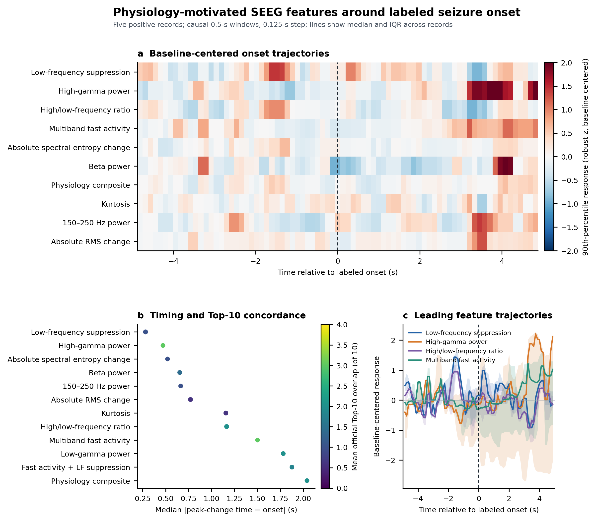

# 样例 SEEG onset 生理特征对齐分析

## 结论摘要

- 本次分析的独立单位是 **5 个具有人工 onset 标注和本地信号的阳性记录**；通道和滑窗是记录内重复测量，不作为独立 `n`。
- **没有单一特征在时间、变化方向和空间定位三方面同时占优。**低频抑制的时间误差最小；高伽马功率与官方 Top-10 的空间重合最好；峰度的 onset 后正向变化方向最一致。因此下一版模型应优先保留这三类互补信息，而不是只选综合名次第一项。
- 在 5/5 个阳性记录中均呈正向 early contrast 的首批特征为：Kurtosis。
- 严重 50 Hz 候选通道排除后的时间误差作为敏感性分析单独报告；主分析不因工频指标事后删除人工 Top-10 通道。

## 方法

- 原始信号：赛事本地样例中的 5 个阳性 NPZ，约 2,000 Hz、60 秒；排除 `POL DC01`–`POL DC16` 和无法解析的特殊通道。
- 时间窗：因果 0.5 秒窗、0.125 秒步长，时间戳位于窗末端，避免使用报告时刻之后的数据。
- 基线：每条记录 onset 前 10～2 秒；每个特征按通道用 median/MAD 做稳健标准化。
- 频谱：直接在原始窗口上计算，不使用可能向 onset 前扩散信息的零相位陷波；频谱汇总时剔除 50 Hz 及其谐波 ±2 Hz。
- 通道聚合：每个时间点取有效 SEEG 通道响应的第 90 百分位，保留局灶起始而避免最大值被单个伪迹支配。
- 时间对齐：在 onset 前 1 秒至后 3 秒内寻找聚合轨迹最大上升沿，报告与人工 onset 的有符号和绝对误差。
- 空间对齐：按 onset 后 0～2 秒最大响应排序，计算预测 Top-10 与赛事人工 Top-10 的重合数。
- 统计边界：仅报告记录级中位数、均值和方向一致率，不对窗口或通道执行伪重复推断，不报告小样本 p 值。

## 优先特征结果

| Feature | 中位绝对时间误差 (s) | 中位有符号误差 (s) | ±0.5 s 命中率 | 中位 early contrast | 正向记录比例 | 平均 Top-10 重合数 | Top-10 中位富集 | 去严重线噪后中位误差 (s) |
|---|---:|---:|---:|---:|---:|---:|---:|---:|
| Low-frequency suppression | 0.282 | +0.282 | 60% | 0.37 | 80% | 1.00 | -0.19 | 0.282 |
| High-gamma power | 0.471 | +0.471 | 60% | -0.12 | 40% | 3.00 | +0.78 | 0.501 |
| High/low-frequency ratio | 1.165 | +1.165 | 40% | 0.16 | 60% | 2.00 | -0.03 | 1.221 |
| Multiband fast activity | 1.501 | +1.501 | 0% | -0.01 | 20% | 3.00 | +0.25 | 2.040 |
| Absolute spectral entropy change | 0.521 | +0.290 | 40% | -0.03 | 40% | 1.00 | -0.34 | 0.479 |
| Beta power | 0.654 | +0.104 | 20% | -0.22 | 0% | 1.40 | +0.20 | 0.721 |
| Physiology composite | 2.040 | +2.040 | 40% | 0.05 | 60% | 2.00 | -0.07 | 1.251 |
| Kurtosis | 1.157 | +1.157 | 0% | 0.21 | 100% | 0.60 | -0.34 | 1.157 |

完整记录级结果见 `reports/onset_features/record_feature_alignment.csv`，所有特征汇总见 `reports/onset_features/feature_summary.csv`。

## 解释规则

1. **时间误差小**表示特征最大上升沿靠近人工 onset，不代表它能在连续阴性数据中保持低误报。
2. **early contrast 大**表示 onset 后 2 秒相对个体基线变化明显；不同特征量纲已经过稳健 z 标准化，但极端值仍可能受伪迹影响。
3. **Top-10 重合高**表示该特征的早期空间分布更接近赛事通道标注；不能直接等同于临床 SOZ、EZ 或手术靶点。
4. 组合特征的当前优势属于预设生理组合在样例上的探索性表现。后续必须拆分到完整患者级验证集，避免在这 5 条记录上继续调权造成过拟合。

## 当前建模优先级

1. **第一优先：低频抑制 + 高伽马功率。**前者提供较好的时间锚点，后者提供相对更好的 Top-10 通道定位；二者在这些样例中互补，但都只在 3/5 记录达到 ±0.5 秒。
2. **第二优先：绝对谱熵变化、ripple 功率和 beta 功率。**它们在 3/5 记录达到 ±1 秒，可作为形态变化和频带变化的补充，而非独立 onset 判据。
3. **第三优先：峰度。**5/5 记录方向一致，但中位时差约 1.16 秒、平均 Top-10 重合仅 0.6，更适合作为发作状态确认特征，而非单独承担定位。
4. **暂不优先：低伽马、多频带快活动、节律性、Teager 能量和 fast-ripple。**当前样例的方向或时间稳定性不足；尤其 HFO 仍需排除短窗频谱泄漏、肌电/尖峰和滤波振铃。

排除 `line50_excess_db > 20 dB` 通道后，多数特征的中位时差没有变化，说明当前整体结论并非由少数严重 50 Hz 通道单独驱动；这只是敏感性分析，不等于这些通道已被证实可安全纳入正式模型。

## 下一步

1. 将排名靠前的单一特征和组合特征加入可复现基线模型，执行逐项消融。
2. 获得完整训练数据和患者 ID 后，以患者为独立单位报告 onset MAE、±1/±3 秒命中率和连续数据误报率。
3. 对 HFO 特征额外执行滤波振铃、最小周期数和 50 Hz 谐波敏感性检查。
4. 比较原始参考、同轴双极和其他临床认可参考方案；当前名称不足以安全自动重参考。

## 可复现产物

- `reports/onset_features/feature_summary.csv`
- `reports/onset_features/record_feature_alignment.csv`
- `reports/onset_features/onset_aligned_trajectories.csv`
- `reports/onset_features/channel_onset_responses.csv`
- `assets/figures/onset_feature_alignment.{png,svg,pdf,tiff}`
- `scripts/analyze_onset_features.py`
