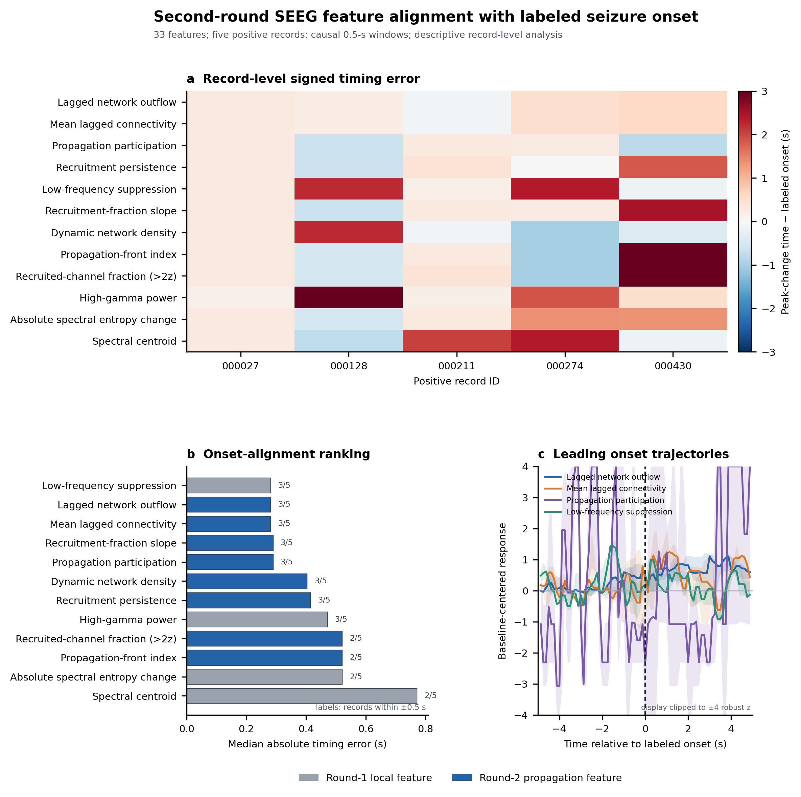

# 样例 SEEG onset 特征第二轮分析

## 技术摘要

- 本轮保留第一轮 **17 项**特征，并新增 **16 项**多通道招募、lead–lag 和动态网络特征，共比较 **33 项**。
- 独立分析单位仍为 **5 条阳性记录**；通道与滑窗不是独立重复，不执行小样本显著性检验。
- onset 专用排序同时考虑中位及平均绝对时间误差、±0.5/±1 秒命中率和 onset 后变化方向一致率；官方 Top-10 仅用于具有通道分辨率的特征。
- 第一轮最佳 onset 特征为 **Low-frequency suppression**，中位绝对误差 0.282 秒；新增传播特征中最佳为 **Lagged network outflow**，中位绝对误差 0.282 秒。
- 两者中位误差相同，但最佳传播特征的平均绝对误差为 0.339 秒，较第一轮最佳的 1.041 秒下降 67.5%；其 ±1 秒命中率为 100%，且 100% 的记录呈 onset 后正向变化。因此它在当前样例上的跨记录稳定性更好。
- 新增通道传播特征中，官方 Top-10 平均重合最高的是 **Recruitment persistence**（1.00/10）。时间吻合与空间通道吻合仍需分别解释。
- 敏感性分析显示，lagged outflow 的优势会随网络历史窗及严重线噪通道排除而减弱，因此当前只能将它列为**优先验证候选**，不能称为已经稳定胜出的 onset 生物标志物。

## 新增特征

### 通道级传播特征

1. recruitment consensus、persistence、change rate 和 early lead；
2. propagation participation；
3. causal lagged outflow、net outflow 和 coactivation strength。

### 全局传播轨迹

1. 超过 2z/3z 的招募通道比例及其斜率；
2. recruitment dispersion 和 propagation-front index；
3. 动态网络密度、最大连通分量比例和平均滞后连接。

所有传播特征只使用当前时刻及之前的窗口。网络连接在过去 1.5 秒的招募轨迹上估计；它是信号驱动的传播代理，不是基于三维坐标的解剖传播速度。

## onset 对齐结果

| Feature | 批次 | 范围 | 中位绝对误差 (s) | 中位有符号误差 (s) | ±0.5 s | ±1 s | 正向变化率 | 平均 Top-10 重合 |
|---|---|---|---:|---:|---:|---:|---:|---:|
| Lagged network outflow | 传播 | channel_propagation | 0.282 | +0.282 | 60% | 100% | 100% | 0.60 |
| Mean lagged connectivity | 传播 | global_propagation | 0.282 | +0.282 | 60% | 100% | 60% | — |
| Propagation participation | 传播 | channel_propagation | 0.290 | +0.251 | 60% | 100% | 60% | 0.40 |
| Recruitment persistence | 传播 | channel_propagation | 0.415 | +0.282 | 60% | 80% | 60% | 1.00 |
| Low-frequency suppression | 第一轮 | channel_local | 0.282 | +0.282 | 60% | 60% | 80% | 1.00 |
| Recruitment-fraction slope | 传播 | global_propagation | 0.290 | +0.282 | 60% | 80% | 40% | — |
| Dynamic network density | 传播 | global_propagation | 0.404 | -0.085 | 60% | 80% | 40% | — |
| Propagation-front index | 传播 | global_propagation | 0.521 | +0.282 | 40% | 80% | 40% | — |
| Recruited-channel fraction (>2z) | 传播 | global_propagation | 0.521 | +0.282 | 40% | 80% | 40% | — |
| High-gamma power | 第一轮 | channel_local | 0.471 | +0.471 | 60% | 60% | 40% | 3.00 |
| Absolute spectral entropy change | 第一轮 | channel_local | 0.521 | +0.290 | 40% | 60% | 40% | 1.00 |
| Spectral centroid | 第一轮 | channel_local | 0.771 | +0.282 | 40% | 60% | 40% | 0.40 |

## Lagged outflow 敏感性分析

| 网络历史窗 (s) | 通道策略 | 中位绝对误差 (s) | 平均绝对误差 (s) | ±0.5 s | ±1 s | 正向变化率 |
|---:|---|---:|---:|---:|---:|---:|
| 1.0 | 全部候选通道 | 0.376 | 0.830 | 60% | 80% | 100% |
| 1.5 | 全部候选通道 | 0.282 | 0.339 | 60% | 100% | 100% |
| 1.5 | 排除 line50 >20 dB | 0.501 | 1.014 | 40% | 60% | 100% |
| 2.0 | 全部候选通道 | 0.904 | 1.191 | 20% | 60% | 100% |

默认 1.5 秒窗得到最好的时间吻合；缩短至 1.0 秒或延长至 2.0 秒后性能下降。排除 `line50_excess_db > 20 dB` 通道后，中位误差由 0.282 秒增至 0.501 秒、平均误差增至约 1.014 秒。这个变化可能同时来自噪声减弱和通道数量大幅减少，现有 5 条记录不足以区分二者。

## 解释边界

1. 每项特征的时间点是在人工 onset 前 1 秒至后 3 秒内寻找最大上升沿得到；这衡量“变化是否靠近 onset”，不等同于独立连续检测性能。
2. 全局传播特征没有通道排序能力，因此其 Top-10 指标记为缺失，而不是记为零。
3. 新增网络特征依赖当前原始参考；共同参考和 50 Hz 污染仍可能抬高连接。正式模型应比较原始参考与可验证的双极参考，并使用通道质量掩码重新建图。
4. 基线标准化在本次回顾性分析中使用 onset 前 10～2 秒；部署时必须换成仅依赖历史数据的自适应基线，不能使用真实 onset 选择基线。
5. 只有 5 条阳性记录，当前排序仅用于确定消融优先级，不能说明跨患者泛化或临床定位有效性。

## 可复现产物

- `reports/onset_features_round2/feature_summary.csv`
- `reports/onset_features_round2/record_feature_alignment.csv`
- `reports/onset_features_round2/onset_aligned_trajectories.csv`
- `reports/onset_features_round2/channel_onset_responses.csv`
- `reports/onset_features_round2/propagation_sensitivity_summary.csv`
- `reports/onset_features_round2/propagation_sensitivity_per_record.csv`
- `assets/figures/onset_feature_alignment_round2.{png,svg,pdf,tiff}`
- `scripts/analyze_onset_features_round2.py`
- `scripts/analyze_propagation_sensitivity.py`
