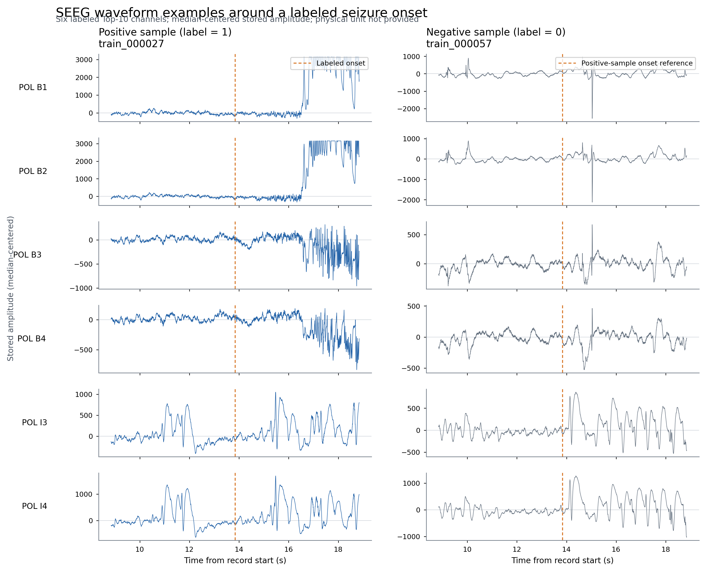
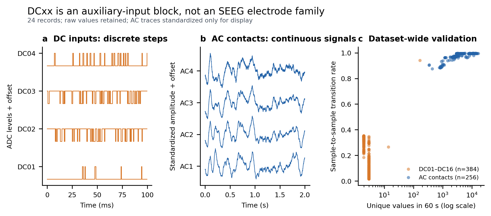
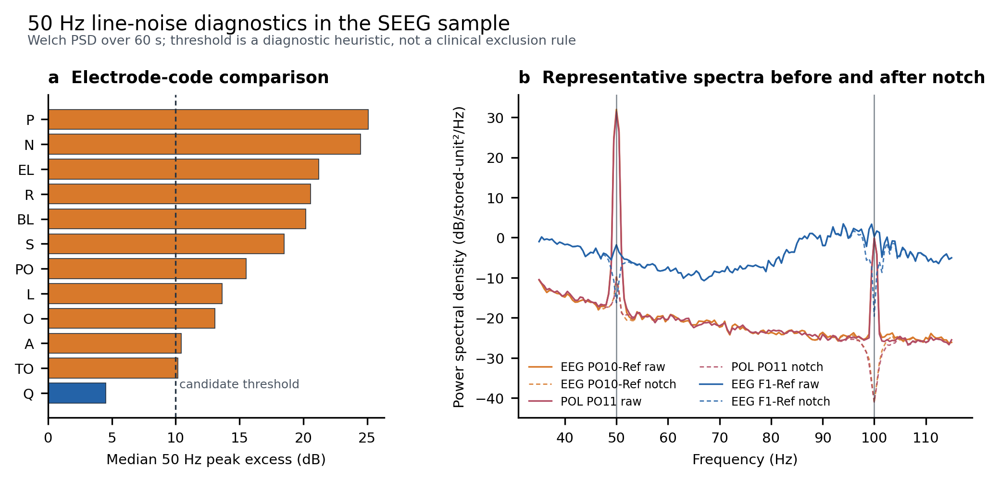

# “脑机接口杯”SEEG 算法系统构建规范

## 1. 技术摘要

赛事要求交付的不是离线结果压缩包，而是一套能在复赛隔离沙箱内完成数据读取、训练/推理、结果校验和 `prediction.csv` 写出的算法程序。系统必须通过 `flydata` 获取非结构化数据，并把唯一的正式结果文件写入 `FlyData.output_path()`。生产阶段不允许下载原始数据或任意查看控制台和结果，因此本地调试、输入兼容、日志摘要和提交前自检必须在进入生产阶段前完成。

本赛题实际是一个联合任务：同时输出发作概率、统一分类阈值、发作起始时间和按重要性排序的 Top-10 通道。总分中分类相关指标占 55%，通道排序占 25%，onset 占 15%，因此系统不应只实现二分类。漏检阳性样本时，其通道得分为 0，onset 按 60 秒误差计算；分类召回会同时影响多个评分分量。

赛事现有资料支持两套并行有效的数据版本：初期 17 包版本约 13 GB，优化单包版本约 800 MB。两套数据可任选其一或同时用于训练和推理，最终评分取最高得分。程序必须以运行时资源清单为准，不得假设只有某个固定压缩包或固定目录层级。

## 2. 规范来源与解释优先级

本规范整合 `docs/赛事方资料/` 中的以下赛事方材料，并结合本项目对本地样例的实测结果：

| 来源 | 主要用途 |
|---|---|
| `3. 复赛结果提交要求.md` | `prediction.csv` 字段、校验规则和评分公式 |
| `关于“脑机接口杯”赛题样例数据集开放的通知v3.docx` | 两套数据版本、使用范围和许可要求 |
| `脑机接口数据结构1.md` | 初期 17 资源包的数据组织方式 |
| `脑机接口数据结构2.md` | 优化单包的数据组织方式 |
| `Flydata文件读取函数使用说明.html` | `load_file`、`fetch_saved_file` 的实际落盘语义 |
| `1. 第五届琶洲算法大赛复赛平台参赛操作指引.pdf` | 沙箱阶段、上传、执行和结果保存流程 |
| `2. 第五届琶洲算法大赛复赛平台产品FAQ_0806.docx` | 平台限制、计算资源、生产阶段权限和常见故障 |
| `4. 可用工具包安装版本.pdf` | 生产环境中的 Python 包版本 |
| 本地 `Dataset/sampleData/` 与 `reports/sample_data_description.md` | NPZ 字段、异常前缀、通道命名和本地数据质量实测 |

解释规则如下：

1. 平台当前页面和“查看联创资源”中显示的资源名称、权限和数据结构优先于静态文档。
2. `复赛结果提交要求.md` 是结果格式和评分行为的直接依据。
3. 两份数据结构文档分别描述不同数据版本，不能相互覆盖。
4. 本地样例统计只用于兼容性开发，不能替代完整正式数据规格。
5. 材料未给出的患者 ID、信号物理单位、参考电极、空间坐标和硬件滤波参数均保持未知。

## 3. 数据版本与规模

### 3.1 初期版本：17 个资源包

- 资源按 `seeg_data_001`～`seeg_data_017` 组织，通知称总量约 13 GB。
- 每组逻辑上包含 `sample/` 和 `formal/`：
  - `sample/`：调试阶段可见，包含训练 NPZ 和本包标签；
  - `formal/`：生产阶段可见，包含无标签测试 NPZ。
- 全部资源合计：
  - 训练文件 440 个，ID 为 `train_000001`～`train_000440`；
  - 测试文件 924 个，ID 为 `test_000001`～`test_000924`。
- 每个样例资源包的 `label.csv` 只描述该包包含的训练文件，加载时需要跨包合并并检查 `sample_id` 唯一性。

### 3.2 优化版本：单个资源包

- 通知称优化版本约 800 MB。
- 数据结构文档用 `sampleData.rar` 表示本地调试样例，用 `data01.rar` 表示完整正式数据。
- 正式数据包逻辑上包含 440 个训练 NPZ、924 个测试 NPZ和训练标签 `label.csv`。
- 文档列出的个别样例文件名与当前本地文件不完全一致，例如文档出现 `test_000701`，当前本地文件为 `test_000610`。因此只能按实际资源枚举文件，不能硬编码示例清单。

### 3.3 使用许可

赛事通知要求在平台签署数据集使用许可协议，禁止外传或用于比赛以外用途。数据、解压内容、患者相关材料、模型中间缓存和正式测试输出不得提交到 Git 仓库。

## 4. 输入数据契约

### 4.1 NPZ 记录

本地样例实测的每个 NPZ 包含以下成员：

| 字段 | 含义 | 处理要求 |
|---|---|---|
| `signal` | 多通道时序，形状为 `(n_channels, n_samples)` | 只使用 `:valid_samples` 范围 |
| `channel_ids` | 官方通道字符串 | 保留原始大小写、空格、前导零和 `-Ref` |
| `raw_channel_indices` | 原始通道索引 | 用于追溯，不当作空间坐标 |
| `sampling_rate` | 采样率，样例约 2,000 Hz | 每条记录读取并校验，不硬编码 |
| `valid_samples` | 有效采样点数 | 必须满足 `0 < valid_samples <= signal.shape[1]` |
| `sample_id` | 样本唯一 ID | 应与文件名 stem 一致 |

当前样例记录为 60 秒，通道数随记录变化。正式程序仍必须按字段动态读取，不能固定通道数、采样点数或通道集合。

本地 23/24 个样例 NPZ 在 ZIP 数据前存在零字节前缀，标准 `numpy.load(path)` 会失败。正式输入层应继续使用项目中的 `seeg_detector.data.load_record`：通过 `zipfile.ZipFile` 定位 ZIP 成员，使用 `numpy.lib.format.read_array(..., allow_pickle=False)` 读取，避免启用 pickle。

### 4.2 训练标签

训练 `label.csv` 的字段为：

```text
sample_id,label,onset_time,ch1,ch2,ch3,ch4,ch5,ch6,ch7,ch8,ch9,ch10
```

- `label` 为发作状态标签。
- 阳性样本给出 `onset_time` 和 Top-10 通道。
- 阴性样本的 onset 在当前样例中为 0，Top-10 为空。
- 跨包合并标签后必须检查 ID 不重复、标签样本均有对应 NPZ、Top-10 通道存在于各自 `channel_ids`。

### 4.3 通道角色

- `POL DC01`～`POL DC16` 是与 Nihon Kohden JE-120A 规范高度一致的辅助 DC 输入块，默认从 SEEG 模型、重参考、频谱特征和 Top-10 候选中排除。
- `POL ACxx` 是连续脑电样信号，应作为普通 SEEG 候选通道处理。
- `EEG ...-Ref` 只表明标签中的参考形式，不能整组删除。
- `A`、`AC`、`PO`、`pMC` 等代码只能用于候选电极轴分组，不能在缺少植入计划和坐标时硬编码为脑区。

更完整的数据实测和设备解释见 `reports/sample_data_description.md`。

### 4.4 本次样例检查结果总表

以下结果只覆盖当前本地 24 个 NPZ 和赛事提供的 440 行训练标签，用于确定输入兼容和预处理策略，不能据此推断完整数据的患者分布或模型性能。

| 检查项 | 实测结果 | 对输入系统的直接要求 |
|---|---|---|
| 标签规模 | 440 行：阳性 110、阴性 330，标签阳性率 25.00% | 类别权重和阈值只能在正式训练划分中确定 |
| 本地信号覆盖 | 20 个训练 NPZ、4 个测试 NPZ；训练信号仅覆盖标签表 4.55% | 允许标签存在但信号尚未下载；建立清单后再训练 |
| 阳性样例 | 本地 5 个阳性；onset 为 10.418–39.771 秒，中位数 25.321 秒 | onset 标签是从记录起点计时的秒数，不转成类别索引保存 |
| 时序尺寸 | 全部为 60 秒、约 2,000 Hz、120,000 个有效点、`float32` | 仍逐文件读取 `sampling_rate` 和 `valid_samples`，不依赖常量 |
| 通道数 | 108、140、148、169、171 或 179 | 模型必须支持变通道数和显式 padding/mask |
| 数值完整性 | 已读有效区间的 finite rate 均为 1.0 | 遇到 NaN/Inf 应拒绝或显式修复并记录，不能静默进入模型 |
| 零值比例 | 文件级约 0.41%–2.83% | 零值不能统一当缺失；应结合 DC、平直段和通道级 QC 判断 |
| 通道元数据 | 每个文件的 `channel_ids` 和 `raw_channel_indices` 均唯一 | 原始字符串作为提交主键；原始索引只用于追溯 |
| 标签通道一致性 | 本地 5 个阳性样本的 Top-10 均存在于对应通道表且无重复 | 将同样检查设为完整训练标签的加载阻断条件 |
| NPZ 容器 | 23/24 个文件带零字节前缀，标准 `numpy.load(path)` 失败 | 必须使用 ZIP 成员级兼容读取器 |

样例文件的全量逐文件统计见 [`sample_file_profile.csv`](sample_file_profile.csv)，详细解释见 [`sample_data_description.md`](sample_data_description.md)。

### 4.5 原始波形和幅值边界

波形检查确认普通候选通道是连续的脑电样时序，同时不同文件和通道的幅值尺度差异明显。样例没有声明物理单位，不能把当前存储数值直接解释为 μV，也不能采用跨记录统一的绝对幅值阈值。



输入处理建议：

1. 永久保留未滤波、未重参考的 `float32` 有效区间作为审计源，不覆盖原数据。
2. 在通道级完成去中位数和稳健尺度估计，例如 MAD/IQR；尺度参数只能从当前记录或训练集拟合，不能使用测试标签信息。
3. 在单位获得确认前，坏道阈值优先使用相对指标：平直率、饱和率、稳健方差、极端跳变率、频谱异常和相邻通道一致性。
4. 模型输入与原始通道 ID、原始索引、角色、QC 标志和变换参数保持一一对应，便于 Top-10 回写和复核。

### 4.6 DC/AC 通道检查确定了不同处理路径

24 条记录均固定含 `POL DC01`～`POL DC16`，形成 384 个“记录 × 通道”对象。DC 通道的不同幅值数量中位数仅为 3，全部幅值均落在约 366.3 存储单位的整数倍上；该结构与 Nihon Kohden JE-120A 的 16 路 DC 输入和 `1 LSB = 366.3 μV` 公开规范精确吻合。DC 通道应归为 `auxiliary_dc`，不是 SEEG 电极轴。

相对地，16 条记录中出现的 `POL AC01`～`POL AC16` 共形成 256 个“记录 × 通道”对象，不同幅值数量中位数为 3,042，波形连续，属于 `seeg_candidate`。名称中的 AC/DC 不能解释为一对“交流脑电/直流脑电”。



处理决策：

- DC 原始通道和索引保留在审计数据中，但默认不进入重参考、脑电滤波、特征、模型或 Top-10 候选。
- 不对 DC 做陷波/带通后再纳入脑电模型；离散跳变经滤波后可能形成伪波形。
- 当前 DC 状态字在 93%–98% 的相邻采样间变化，不符合常见稀疏稳定 TTL trigger，不能从中生成 onset marker。
- 若赛事方确认某一路连接刺激器、视频同步或生理外设，再针对该路建立阈值、边沿、去抖和最小脉宽解码；解码结果作为事件或辅助变量。
- AC 通道继续参与普通 SEEG QC；不能按名称排除。

可复现指标见 [`auxiliary_channels/channel_metrics.csv`](auxiliary_channels/channel_metrics.csv) 和 [`auxiliary_channels/role_summary.csv`](auxiliary_channels/role_summary.csv)。

### 4.7 50 Hz 噪声是通道级问题，不是前缀级问题

对 3,611 个“记录 × 通道”的 Welch 频谱检查显示，1,036 个通道（28.69%）的 49.5–50.5 Hz 功率相对两侧背景超过 10 dB。该阈值仅用于筛查，不等同于坏道标准。

- `EEG ...-Ref` 候选率为 28.54%，`POL` 为 28.71%，几乎相同，因此不能按 `-Ref` 或 `POL` 整组删除。
- 污染集中在具体电极代码和记录配置：代码 `P` 的 56 个记录通道全部超过 10 dB，中位增量 25.07 dB；`PO` 的 160 个通道中 53.75% 超过，中位增量 15.51 dB；`F` 的中位增量仅 1.02 dB。
- `train_000211` 中 `EEG PO10-Ref` 和 `POL PO11` 均有约 44–45 dB 尖峰，而 `EEG F1-Ref` 没有明显尖峰，再次说明前缀不能代表通道质量。
- 50 Hz 与 100 Hz 峰值增量相关，Pearson `r=0.673`，符合市电基频及谐波污染特征；缺少阻抗、参考和设备滤波日志时不能进一步归因到具体记录故障。



推荐处理顺序：

1. 在滤波前计算每通道 50/100/150 Hz 相对背景增量并保存基线指标。
2. 以 CleanLine/正弦回归类自适应去噪为首选候选，以窄带零相位 50 Hz 陷波作为可复现基线；不要使用宽达 45–55 Hz 的带阻。
3. 去噪后用同一指标复测，比较残余线噪声及邻近频带损失。
4. 只有线噪声残余明显且同时伴随饱和、平直、宽带异常或持续异常时才标记坏道。
5. 相邻双极、CAR 或 Laplacian 重参考必须在获得电极轴和相邻关系后验证，不能仅凭字母代码自动执行。
6. 若研究高频振荡或 50 Hz 邻域信息，保留滤波前后双版本并做敏感性分析。

可复现指标见 [`line_noise/channel_metrics.csv`](line_noise/channel_metrics.csv)、[`line_noise/channel_form_summary.csv`](line_noise/channel_form_summary.csv) 和 [`line_noise/electrode_code_summary.csv`](line_noise/electrode_code_summary.csv)。

### 4.8 命名、设备与空间信息边界

样例共出现 3,611 次通道记录和 413 个不同完整 ID，可保守解析为：

```text
<来源前缀> <电极/轨迹代码><接触点编号><可选参考标记>
```

- `raw_channel_id` 是提交和跨模块匹配的唯一权威字符串。
- `source_prefix`、`electrode_code`、`contact_number`、`reference_tag` 只用于分组、排序和 QC。
- 大小写有意义：`PO`、`mPO`、`pMC`、`aMC` 不能合并；`DC01` 的前导零必须保留。
- 同一代码可能跨 `EEG ...-Ref` 与 `POL ...` 两种形式，分组后回写仍使用完整原名。
- `POL E` 是唯一不符合“代码 + 数字”的样例名称，应进入特殊通道人工/规则复检。

`DC01`～`DC16`、366.3 量化步长及 2 kHz/不超过 256 通道的组合强烈支持 JE-120A/Neurofax 或兼容接口采集链，但 NPZ 没有厂商、型号、序列号或原始文件头，不能确认具体设备。

JE-120A 是采集放大器，不提供患者通用的 SEEG 空间模板。同一代码的连续编号最多支持“候选同轴、相对排序”推断，不能确定左右侧、编号方向、接触点间距、脑区或 `(x, y, z)`。空间建模必须等待 BIDS `*_electrodes.tsv` + `*_coordsystem.json`，或术后 CT、术前 MRI、植入计划和电极型号。

### 4.9 EEGLAB 转换检查

当前已将 20 个本地训练 NPZ 转换为单文件 EEGLAB `.set`，并生成 `outputs/eeglab_sample/manifest.csv`：

- 15 个阴性记录不写伪事件；5 个阳性记录各含一个 `seizure_onset`。
- EEGLAB 事件延迟使用一基采样点公式 `latency = onset_time * srate + 1`，从 latency 反算秒数与标签一致。
- DC 通道保留但类型设为 `MISC`；AC 和其他候选脑电通道设为 `SEEG`。
- 完整原始名称同时保存在 `EEG.chanlocs.original_label` 和 `EEG.etc.original_channel_ids`，避免 EEGLAB 自动移除 `EEG ` 前缀后无法回写赛事 ID。
- 原始通道索引、通道角色、有效点数和 onset 秒数保存在 EEGLAB 元数据中；信号不滤波、不重参考、不降采样。

MATLAB 批量校验脚本会检查通道/点数、连续数据结构、原始标签、16 个 DC 的 `MISC` 类型、AC 的 `SEEG` 类型以及事件时间一致性。EEGLAB 文件用于人工波形和事件检查，不应成为比赛训练的唯一中间格式，以免引入额外磁盘和格式转换开销。

### 4.10 推荐的数据输入处理流水线

正式训练和推理应执行同一套确定性流水线，仅训练分支允许读取标签：

```text
赛事资源发现
  -> 压缩包/文件树枚举
  -> 安全 NPZ 成员读取
  -> 文件与字段契约校验
  -> 截取 valid_samples
  -> 通道名称保真解析
  -> 通道角色划分（SEEG / auxiliary_dc / special）
  -> 数值、平直、饱和、跳变和频谱 QC
  -> DC 与坏道 mask
  -> 条件式线噪声处理并复测
  -> 训练集内拟合的稳健归一化
  -> 变通道 padding + attention/channel mask
  -> 模型推理
  -> onset 与 Top-10 回写原始通道 ID
  -> prediction.csv 全量拒错校验
```

实现时应同时返回 `signal`、`valid_sample_mask`、`channel_mask`、`channel_roles`、`raw_channel_ids`、`raw_channel_indices`、`sampling_rate`、`qc_metrics` 和 `transform_metadata`。任何丢弃、插值、滤波或重参考操作都必须记录原因和参数；禁止只返回无法追溯通道身份的裸张量。

## 5. Flydata 数据接入规范

### 5.1 非结构化赛事资源

赛题 NPZ、CSV 和压缩包属于非结构化资源，应使用：

```python
from flydata import FlyData

handler = FlyData()
resource_tree = handler.load_file(source_id)
```

`source_id` 必须取自任务页面“查看联创资源”的实际资源名称。`load_file` 返回嵌套目录字典，同时把文件放到：

```text
data_source/<source_id>/
```

返回字典中，普通键表示子目录，空字符串键 `""` 表示当前目录直接包含的文件。输入适配器应递归遍历返回结构或对应目录，识别 `label.csv`、`train_*.npz`、`test_*.npz` 及压缩包，不能依赖字典键顺序。

### 5.2 跨过程保存文件

读取任务存储中的模型、日志或中间文件时使用：

```python
saved_path = handler.fetch_saved_file("debug/model.pkl")
```

- `debug/...` 表示调试空间文件；
- `production/...` 表示生产空间文件；
- 方法会将文件放到 `fetched_files/` 并返回可读取路径。

赛事 FAQ 说明，调试过程只能读取调试空间；生产过程可读取调试和生产空间。不得假设任意主机绝对路径在沙箱中存在。

### 5.3 结果路径

唯一正式结果应写入：

```python
from pathlib import Path

output_dir = Path(handler.output_path())
output_dir.mkdir(parents=True, exist_ok=True)
prediction_path = output_dir / "prediction.csv"
```

评分器会在 `output_path()` 对应目录寻找结果。不要把正式文件写到当前工作目录、`data_source/` 或 `fetched_files/`。

## 6. 输出文件硬性规范

提交目录中只能有一个正式 `prediction.csv`，编码为 UTF-8，字段顺序建议严格保持：

```text
sample_id,prob,decision_threshold,onset_time,ch1,ch2,ch3,ch4,ch5,ch6,ch7,ch8,ch9,ch10
```

| 字段 | 硬性要求 |
|---|---|
| `sample_id` | 覆盖全部且仅覆盖正式测试 ID；非空、不重复；字符完全一致 |
| `prob` | 有限浮点数，`0 <= prob <= 1` |
| `decision_threshold` | 有限浮点数，`0 <= threshold <= 1`；全表只能有一个值 |
| `onset_time` | 所有行都必须是有限数值，范围 `[0, 60)`；预测阴性建议填 `0.0` |
| `ch1`～`ch10` | 预测阳性时必须填满 10 个、互不重复、属于该样本的官方通道名，并按重要性排序 |

预测类别由评分器计算：

```python
predicted_label = int(prob >= decision_threshold)
```

禁止添加 `label` 列。预测阴性时 `ch1`～`ch10` 可以为空，但列必须存在。所有通道名必须直接来自对应样本 `channel_ids`；不能改写 `EEG `、`POL `、大小写、数字前导零或 `-Ref`。

建议先写临时文件，完成重新读取和全量校验后再原子替换为 `prediction.csv`，避免中断时留下半个 CSV。正式输出目录不得保留第二个同名文件、备份副本、模型、日志或缓存。

## 7. 评分规则对模型设计的约束

总分为：

```text
Score = 0.25*AUC
      + 0.15*F1
      + 0.10*Sensitivity
      + 0.10*Specificity
      + 0.25*ChannelScore
      + 0.15*OnsetScore

OnsetScore = max(0, 1 - MAE_onset / 60)
```

模型与验证程序应对应实现五类输出或评估组件：

1. **概率头**：输出连续概率并优化排序能力，供 AUC 使用；不要只输出 0/1。
2. **全局阈值选择**：只能从训练/验证数据选择一个全表一致阈值，同时观察 F1、Sensitivity 和 Specificity。
3. **onset 头**：对预测阳性输出 `[0, 60)` 内时间；训练时应明确阴性样本是否参与 onset 损失。
4. **通道重要性头**：在每条记录自己的有效 SEEG 候选中排序；屏蔽 DC、缺失和坏通道，输出原始名称。
5. **提交联动逻辑**：一旦 `prob >= threshold`，就必须能够稳定生成 10 个合法通道；候选不足 10 个时应在提交前失败，而不是写出非法文件。

漏检阳性会同时降低 Sensitivity、F1、ChannelScore，并使该样本 onset 误差按 60 秒处理。因此阈值不能只按分类准确率选择，应在本地完整复刻加权评分后统一搜索。

赛事材料未给出 ChannelScore 的精确重合/排序公式细节，也未说明 AUC 在单类边界情形的处理。正式复现评分器前，这两部分必须标为待赛事方确认，不能自行声称与官方完全一致。

## 8. 建议的系统结构

```text
entrypoint
├── platform_adapter
│   ├── 初始化 FlyData
│   ├── 加载运行时 source_id
│   └── 解析 output_path / saved files
├── resource_discovery
│   ├── 递归遍历 1 包或 17 包资源
│   ├── 安全解压 RAR/ZIP
│   └── 汇总 train/test/label 清单
├── data_validation
│   ├── NPZ 容器与字段校验
│   ├── ID、标签和通道对齐
│   └── 有限值、形状和采样率检查
├── preprocessing
│   ├── 有效区间截取
│   ├── DC/坏道掩码
│   ├── 线噪声处理
│   └── 归一化与可选重参考
├── training
│   ├── 数据划分与防泄漏
│   ├── 多任务损失
│   ├── 阈值选择
│   └── 模型与配置保存
├── inference
│   ├── 发作概率
│   ├── onset 时间
│   └── Top-10 原始通道名
├── submission_validator
│   └── 按官方规则全量拒错
└── output_writer
    └── 原子写入 output_path/prediction.csv
```

推荐将平台适配代码限制在入口和 `platform_adapter` 中，核心数据、模型和评估模块只接收普通路径及 Python 对象。这样本地测试无需安装 `flydata`，进入平台后也只需替换资源发现和输出路径部分。

训练、推理和输出均应由一个非交互式入口命令完成，例如：

```text
python scripts/run_competition.py --config configs/competition.toml
```

入口应返回非零退出码表示失败，并在失败前输出不含原始患者数据的短错误摘要。生产阶段无法依赖人工修复、Notebook、GUI 或运行中下载。

## 9. 沙箱和部署约束

| 项目 | 赛事限制 | 工程含义 |
|---|---|---|
| 算法上传包 | ZIP，最大 10 MB | 模型权重和大资源不要放进代码 ZIP |
| 单次执行 | 最长 5 小时 | 训练、推理、校验和写出必须留安全余量 |
| 正式结果 | 总产出建议控制在 1 GB 内 | `output_path` 只保留必要结果，正式评分只需 CSV |
| 存储上传 | 单文件最大 10 GiB；一次 1 个文件 | 大模型以压缩包上传并在脚本内解析 |
| 存储目录 | 最多 50 个文件夹，最多 3 层 | 不创建深层实验目录树 |
| 生产可见性 | 无任意控制台查看、无结果下载 | 调试阶段完成全部自检，生产日志只留摘要 |
| 评测次数 | 每队每日最多 3 次成功评测 | 本地验证通过后再进入生产评测 |
| 任务数量 | 同一赛题每位选手最多 5 个任务 | 用配置和算法版本管理实验，不滥建任务 |

赛事 FAQ 要求训练和推理均在复赛平台内完成。预训练基础模型由参赛方自行提供；上传权重时需在作品说明中列出权重文件清单和哈希值，以备审计。

平台公布的共享计算资源为 8 张 4090D、总显存 192 GB。该数字是供所有选手调用的资源池，不应在代码中假设本任务独占 8 卡。系统默认应支持单卡运行，并通过环境检测启用数据并行；显存、CPU 数和 worker 数都应在启动时动态确定。

## 10. 平台软件环境

与本算法直接相关的已公布版本包括：

| 软件包 | 平台版本 |
|---|---:|
| NumPy | 1.26.4 |
| pandas | 2.3.3 |
| SciPy | 1.15.3 |
| scikit-learn | 1.7.2 |
| PyTorch | 2.7.1+cu118 |
| torchvision | 0.22.1+cu118 |
| torchaudio | 2.7.1+cu118 |
| PyTorch Lightning | 2.6.5 |
| torch-geometric | 2.8.0.post1 |
| MNE | 1.12.1 |
| PyWavelets | 1.8.0 |
| h5py | 3.16.0 |
| joblib | 1.5.3 |
| LightGBM | 4.7.0 |
| XGBoost | 3.2.0 |
| CatBoost | 1.2.10 |
| Optuna | 4.9.0 |
| matplotlib | 3.10.9 |
| seaborn | 0.13.2 |
| numba | 0.66.0 |

当前项目 `pyproject.toml` 声明 `numpy>=2.0,<3`，与平台 NumPy 1.26.4 不兼容，是进入平台前必须修复的部署阻断项。建议以平台版本建立单独的锁定环境或约束文件，并在相同版本下运行读取、训练和提交测试。不得在生产任务中依赖联网安装未公布的软件包。

## 11. 验证和测试要求

### 11.1 输入验证

- 同时测试单包和 17 包资源发现。
- 测试普通 NPZ、带零前缀 NPZ、成员缺失和损坏压缩包。
- 检查每个 `sample_id` 唯一，文件名、NPZ 元数据和标签一致。
- 检查不同通道数、通道顺序和采样率，不使用跨样本固定索引。
- 检查所有进入模型的数值有限，并记录坏道掩码。
- 在获得患者映射前，不把同名通道或相同通道表当作患者 ID。

### 11.2 训练和推理验证

- 固定随机种子并保存配置、代码版本和模型哈希。
- 避免同一原始长记录的相邻窗口跨训练/验证集合。
- 验证 DC 通道不会进入神经模型和 Top-10。
- 验证 onset 输出始终属于 `[0, 60)`。
- 验证通道排序在通道屏蔽、缺失和并列分数时仍具有确定性。
- 记录单条和全量推理时间，确保总流程在 5 小时限制内留有余量。

### 11.3 提交阻断检查

写出正式结果前必须全部通过：

- 文件名严格为 `prediction.csv`，输出目录中不存在第二份同名文件。
- 列名和列数精确，且不含 `label`。
- 测试 ID 全覆盖、无额外、无重复。
- `prob`、阈值、onset 均为有限数值且范围合法。
- `decision_threshold` 全表唯一。
- 预测阳性行恰有 10 个非空、唯一、属于该样本的原始通道名。
- 预测阴性行 onset 建议为 `0.0`，十个通道字段保留。
- CSV 重新读取后内容、行数、编码和字符串均未改变。

## 12. 当前不确定项与待赛事方确认问题

以下信息会实质影响算法或官方分数复现，现有材料不能确认：

1. 平台中两套数据的准确 `source_id` 以及生产阶段返回的实际目录层级。
2. 17 包版本中训练/测试对象的患者分组关系，以及是否存在同患者多条记录。
3. 信号幅值单位、参考电极、硬件滤波和各电极轴命名含义。
4. ChannelScore 的精确重合与排序权重公式。
5. onset 标注定义、标注误差容忍度以及评分是否只统计真实阳性。
6. 两套数据同时使用时，测试 ID 是否完全相同、是否需要分别执行和分别提交。
7. RAR 解压工具在生产镜像中的可用性；若不可用，应由平台直接展开资源或改用其提供的文件树。
8. GPU 调度实际分配方式、CPU/内存/磁盘配额及是否允许多进程 DataLoader。

在这些问题获得官方答复前，程序应采用运行时探测、保守默认值和明确失败，而不是静默猜测。

## 13. 数据检查产物索引

| 产物 | 内容 |
|---|---|
| [`sample_data_description.md`](sample_data_description.md) | 本地样例逐项描述、命名、设备、坐标边界和文件概览 |
| [`sample_file_profile.csv`](sample_file_profile.csv) | 24 个 NPZ 的形状、数值、前缀和兼容性统计 |
| [`auxiliary_channels/channel_metrics.csv`](auxiliary_channels/channel_metrics.csv) | DC/AC 通道级离散度、跳变率和量化步长指标 |
| [`auxiliary_channels/role_summary.csv`](auxiliary_channels/role_summary.csv) | DC 与 AC 角色汇总 |
| [`line_noise/channel_metrics.csv`](line_noise/channel_metrics.csv) | 3,611 个记录通道的 50/100 Hz 指标 |
| [`line_noise/channel_form_summary.csv`](line_noise/channel_form_summary.csv) | `EEG ...-Ref` 与 `POL` 前缀对比 |
| [`line_noise/electrode_code_summary.csv`](line_noise/electrode_code_summary.csv) | 电极代码级工频噪声汇总 |
| [`onset_feature_analysis.md`](onset_feature_analysis.md) | 5 条阳性样例的优先生理特征、人工 onset 时间对齐和 Top-10 空间对齐结论 |
| [`onset_features/feature_summary.csv`](onset_features/feature_summary.csv) | 记录级汇总的时间误差、变化方向一致率和 Top-10 重合度 |
| [`onset_feature_analysis_round2.md`](onset_feature_analysis_round2.md) | 扩展至33项特征的第二轮 onset 对齐、传播特征和敏感性分析 |
| [`onset_features_round2/feature_summary.csv`](onset_features_round2/feature_summary.csv) | 第二轮记录级特征排名与范围标记 |
| [`../assets/figures/sample_waveforms_onset.png`](../assets/figures/sample_waveforms_onset.png) | 原始波形和 onset 示例 |
| [`../assets/figures/dc_ac_channel_diagnostic.png`](../assets/figures/dc_ac_channel_diagnostic.png) | DC/AC 波形和离散度对比 |
| [`../assets/figures/line_noise_diagnostic.png`](../assets/figures/line_noise_diagnostic.png) | 50 Hz 工频噪声示例与汇总 |
| `outputs/eeglab_sample/manifest.csv` | 20 个训练 `.set` 的通道、事件和文件清单 |
| `scripts/validate_eeglab_exports.m` | EEGLAB 批量结构和事件校验 |

## 14. 实施优先级

1. 修正本地依赖以兼容平台 NumPy 1.26.4，并建立平台锁定环境。
2. 实现 `FlyData` 平台适配层、单包/多包资源发现和安全 NPZ 读取。
3. 实现与官方要求逐项对应的 `prediction.csv` 校验器和原子写出器。
4. 实现本地加权评分框架，并将 ChannelScore 未知部分隔离成可替换模块。
5. 建立支持变通道数和通道掩码的分类、onset、Top-10 联合基线。
   样例探索结果建议 onset 头优先输入低频抑制和高伽马功率，状态确认补充峰度、绝对谱熵变化与 ripple/beta 功率；这些选择必须在患者级划分和连续阴性数据上消融验证。
6. 在调试阶段完成 5 小时端到端演练、故障注入和结果重读验证。
7. 固化生产配置、入口命令、模型哈希和作品说明后再申请生产评测。
